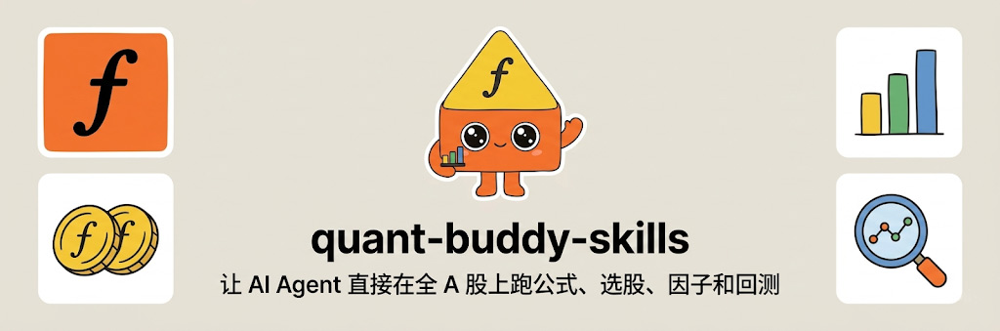
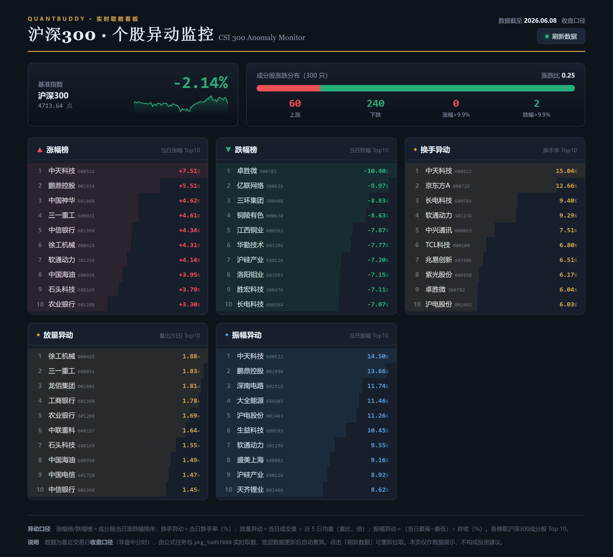

# quant-buddy-skills

<p align="center">
  
</p>

<p align="center">
  <a href="README.md">中文</a> ·
  <a href="README.en.md">English</a> ·
  <a href="https://www.quantbuddy.cn">Official Site</a> ·
  <a href="https://tcn8bvcbyokw.feishu.cn/wiki/E1zswck3oiiJjJkP07QcmSG3nle?from=from_copylink">Beginner Guide</a>
</p>

<p align="center">
  <a href="https://github.com/pseudo-longinus/quant-buddy-skills/stargazers"></a>
  <a href="https://github.com/pseudo-longinus/quant-buddy-skills/blob/main/LICENSE"></a>
  
  
</p>

## 🔥 Quick Install

If you're familiar with AI agent tools (Claude Code, Cursor, OpenClaw, etc.), just tell your agent:

> Install this skill for me:

```bash
npx skills add pseudo-longinus/quant-buddy-skills -g -a claude-code -s quant-buddy-skill -y
```

Not sure how to use agents or skills? Follow the [step-by-step beginner guide](https://tcn8bvcbyokw.feishu.cn/wiki/E1zswck3oiiJjJkP07QcmSG3nle?from=from_copylink).

---

> **Run formulas, stock screens, factors, and backtests across the full A-share market from an AI Agent.**  
> A-share quant execution layer for Claude Code, Cursor, Codex, GitHub Copilot, Windsurf, and other AI agents.

quant-buddy-skills is not a generic stock data API. It packages **market data, valuation data, financial data, a formula engine, full-market screening, factor calculation, strategy backtesting, NAV comparison, and chart rendering** into agent-callable research workflows.

Data coverage includes common research datasets such as A-share financials, HK/US financials, LHB tags, and GICS industry classifications.

Traditional data APIs only get raw data out. quant-buddy-skills helps an AI agent turn natural-language research ideas into **executable formulas, platform-side computation, structured results, and reusable tasks**.

Official site: https://www.quantbuddy.cn

> This project is for financial data analysis, quantitative research, strategy validation, and educational use only. It is not investment advice, trading advice, a return guarantee, or an automated trading service.

## 30-Second Demo

Tell your AI agent:

```text
Screen all A-shares at 14:30 today. Find companies hitting a 60-trading-day high,
with turnover above 2x the past 20-day average, ranked by intraday return.
```

The agent generates a formula chain. quant-buddy runs the full-market computation on the platform side, then returns only the TopN stock list, metrics, ranking, and charts.

No need to push thousands of rows into the LLM context. No need to manually write data cleaning, field joins, or backtesting code.

## Why Install It

- **Not just data lookup**: formulas, rolling-window statistics, condition filters, factor ranking, and strategy backtesting.
- **Built for full-market A-share cross-sectional computation**: heavy computation runs on the platform side; only results are returned to the agent.
- **Reusable by design**: formulas explored today can be scheduled and rerun tomorrow.
- **Designed for agent workflows**: works with Claude Code, Cursor, Codex, GitHub Copilot, Windsurf, and similar environments.
- **Deepest coverage for A-shares**: market data, valuation, financials, screening, factors, backtesting, and charts. HK and US stocks support market data plus selected valuation and financial fields, subject to API results. Recognized futures can be queried conditionally for market/window series.
- **Broader research-data coverage**: supports common datasets such as A-share financials, HK/US financials, LHB tags, and GICS industry classifications.

## What Can You Do In One Sentence

| What You Tell The Agent | What quant-buddy-skills Does |
|---|---|
| “Check Kweichow Moutai's latest close, return, and turnover” | Queries market data and returns structured results |
| “Find the top 10 A-shares breaking above 60-day highs with volume expansion” | Runs full-market formulas, filters, and ranking on the platform side |
| “Backtest a low PE + high ROE portfolio and compare it with CSI 300” | Runs strategy backtesting, benchmark comparison, and NAV chart output |
| “Run this screen every day at 14:30” | Saves validated formulas as reusable tasks |
| “Publish this set of computed metrics as a data pack a web page can read directly” | Registers a formula package, returns credentials, and lets a front end / third party stream the latest values without an API Key |
| “Upload my CSV factor and rank it together with ROE” | Uploads custom factors and uses them in formulas, screening, and charts |

## Skill Matrix

| Capability | Coverage | Example Prompt |
|---|---|---|
| Fast market data lookup | A-shares / HK stocks / US stocks / indices / recognized futures, subject to API results | “Check Kweichow Moutai's latest close, return, and turnover” |
| Valuation and financials | A-shares plus selected HK / US fields, subject to API results | “List CATL's latest ROE, net profit, and debt ratio” |
| Common research datasets | A-share financials, HK/US financials, LHB tags, GICS industry classifications, etc. | “Check net profit attributable, EBITDA, LHB net buy amount, or GICS industry” |
| Full-market formula computation | Mainly A-shares | “Calculate 20-day and 60-day returns for all A-shares and rank by momentum” |
| Multi-condition stock screening | Mainly A-shares | “Screen non-ST stocks with low PE, high ROE, and expanding turnover” |
| Factor analysis | Mainly A-shares | “Build a composite factor from dividend yield, ROE, and momentum” |
| Strategy backtesting | Mainly A-shares | “Backtest a low PE + high ROE portfolio against CSI 300” |
| Intraday tasks | A-share minute-data capability, subject to actual API support | “At 14:30 today, screen the top 30 stocks breaking above 60-day highs with volume expansion” |
| Chart rendering | Candlestick, NAV, benchmark comparison | “Plot the strategy NAV and CSI 300 benchmark” |
| Formula packages | Register a formula set as a long-lived package, served to the outside via SSE without an API Key | “Publish this screen as a data page the front end can read directly” |
| Custom data | CSV factor upload | “Upload my factor CSV and rank it together with ROE” |

## Who Is This For

- **A-share quant researchers** who want to validate screening, factor, event-study, and backtesting ideas quickly.
- **AI agent and coding-tool users** who want Claude Code, Cursor, Codex, or GitHub Copilot to complete research tasks directly.
- **Research automation developers** who want daily review, intraday screens, and strategy monitoring as repeatable jobs.
- **Financial data analysts and content creators** who want structured data, TopN lists, and charts from natural language.

## Who Is This Not For

- Users who need a fully custom low-level data pipeline.
- Users focused mainly on crypto, options, futures valuation/financials, or deep US fundamental valuation.
- Users expecting automated order execution, return guarantees, or personalized investment advice.

## Real Invocation Examples

The following examples were generated by actual quant-buddy-skill calls on 2026-05-18. Market data changes over time, but the examples show the core workflow: natural language enters the AI agent, formulas are computed on the platform side, and only structured results are returned to the LLM.

### Example 1: Ask In Natural Language, Return Multiple Indicators

User prompt:

```text
Check Kweichow Moutai's latest close price, daily return, and turnover.
```

The agent generates and runs:

```text
贵州茅台收盘 = "全市场每日收盘价" * 取出(贵州茅台)
贵州茅台涨跌幅 = "全市场每日回报率" * 取出(贵州茅台)
贵州茅台成交额 = "全市场每日成交额" * 取出(贵州茅台)
```

Actual result:

| Date | Stock | Close | Daily Return | Turnover |
|---|---|---:|---:|---:|
| 2026-05-18 | Kweichow Moutai | 1323.69 | -0.70% | RMB 4.601B |

This is the shortest path: natural-language prompt -> formula generation -> platform-side data retrieval -> structured result.

### Example 2: Full-Market Formula Computation Without Sending Huge Tables To The LLM

User prompt:

```text
Screen all A-shares that break above their 60-day high today, with turnover greater than 2x the past 20-day average, then rank the top 10 by daily return.
```

The agent generates a formula chain:

```text
A股池 = 板块(万得全A) * 缺失填零("非ST股")
60日高基准 = 昨天(最大("全市场每日最高价", 60))
放量基准 = 昨天(平均("全市场每日成交额", 20))
突破60日新高 = ("全市场每日最高价" > "60日高基准") * "A股池"
成交额放量 = ("全市场每日成交额" > 2 * "放量基准") * "A股池"
排序值 = "突破60日新高" * "成交额放量" * 涨跌幅("全市场每日收盘价")
放量突破Top10 = 取前("排序值", 10, 返回数值)
```

Actual result:

| Rank | Stock | Ticker | Daily Return |
|---:|---|---|---:|
| 1 | 凡拓数创 | SZ301313 | 20.00% |
| 2 | 索辰科技 | SH688507 | 20.00% |
| 3 | 隆达股份 | SH688231 | 18.23% |
| 4 | 蓝思科技 | SZ300433 | 13.97% |
| 5 | 长盈通 | SH688143 | 13.21% |
| 6 | 广信材料 | SZ300537 | 13.12% |
| 7 | 卡倍亿 | SZ300863 | 12.70% |
| 8 | 佰奥智能 | SZ300836 | 11.79% |
| 9 | 线上线下 | SZ300959 | 11.68% |
| 10 | 中巨芯 | SH688549 | 10.48% |

The full-market raw matrix is not pushed into the LLM context. quant-buddy performs the computation, filtering, and ranking on the platform side, then returns only the Top 10 result. In the actual call, reading the final Top 10 detail returned only 10 rows, and the `readData` response showed `cost` = 2 RU.

### Example 3: Explore Once, Save The Formula, Reuse It Later

During exploration, the user can ask:

```text
Design a 14:30 intraday screening condition: break above the 60-day high, turnover above 2x the past 20-day average, and output the top 10 by return.
```

After validation, the formula can be saved as a reusable task:

```json
{
  "name": "volume_breakout_60d_intraday",
  "description": "14:30 intraday 60-day-high breakout with volume expansion",
  "params": {
    "formulas": [
      "A股池 = 板块(万得全A) * 缺失填零(\"非ST股\")",
      "60日高基准 = 昨天(最大(\"全市场每日最高价\", 60))",
      "放量基准 = 昨天(平均(\"全市场每日成交额\", 20))",
      "突破60日新高 = (\"全市场每日最高价\" > \"60日高基准\") * \"A股池\"",
      "成交额放量 = (\"全市场每日成交额\" > 2 * \"放量基准\") * \"A股池\"",
      "排序值 = \"突破60日新高\" * \"成交额放量\" * 涨跌幅(\"全市场每日收盘价\")",
      "放量突破Top10 = 取前(\"排序值\", 10, 返回数值)"
    ],
    "begin_date": 20260101,
    "include_description": true,
    "use_minute_data": true,
    "force_reusable_array": ["放量突破Top10"]
  }
}
```

After that, an agent or scheduler can run the same formula at 14:30 every day:

```bash
GZQ_PARAMS='<the params JSON above>' python scripts/call.py runMultiFormulaBatchStream
```

Then read the final result from the returned `data_id`:

```bash
GZQ_PARAMS='{"ids":["<data_id>"],"mode":"last_column_full"}' python scripts/call.py readData
```

This separates exploration from usage: explore and iterate with natural language first, then reuse stable formulas as production research tasks.

## Formula Packages: Publish a Validated Formula Set to the Outside

Example 3 fixes formulas into a task your own agent / scheduler reruns. **Formula packages** go one step further — register a validated set of formulas as a **long-lived data service** so your own web page, dashboard, or a third party can read the latest results repeatedly, **without an API Key**.

Register once (needs an API Key) and you get a pair of credentials, `package_id` + `signature`. After that, anywhere that can send an HTTP request can pull data **streamed over SSE** with those credentials. Whenever the underlying data updates, the server **recomputes automatically along the dependency graph**, so a query always returns the latest values — never stale data.

> How it differs from `runMultiFormulaBatchStream`: that runs on **your own account side** (the agent / scheduler executes and reads a `data_id`); a formula package instead **exposes the computed outputs read-only via a credential** — the query side needs no API Key and spends no quota of its own, and billing always lands on the **package owner**. The two execution pools and billing are independent.

**Use cases**

- **Build your own research daily report / dashboard**: register the metrics you review every day (screening lists, factor rankings, valuation percentiles, money flow, …) as one package, then `fetch` and render them from a single static HTML page. Open the page and you see today's latest data — **no backend, no manual recompute**.
- **Give a team / client a read-only data page**: hand out `package_id` + `signature`, not your API Key. They can only read the outputs you fixed — they can't change formulas or touch your account, and you can revoke any time.
- **Embed into an existing site / Notion / Feishu / a wall display**: anywhere `fetch` runs, you can pipe quant-buddy's computed results into your own page.
- **Third-party / lightweight integration**: hand a precomputed metric package to a partner for read-only access with zero config.

**What you can build: two real pages powered by formula packages**

Both pages below are **plain static HTML** — no backend, no database. They just `fetch` a formula package in the browser and render the returned `outputs` into tables and charts. Whenever the underlying data updates, a page refresh shows today's latest values, and the **API Key never touches the front end**.

<p align="center">
  
  <br/>
  <sub><b>Global market-temperature dashboard</b> · seven major indices, a market-wide valuation "bubble temperature", plus commodity and bond trends — the whole page comes from a single formula-package query.</sub>
</p>

<p align="center">
  
  <br/>
  <sub><b>CSI 300 anomaly monitor</b> · gainers / losers, turnover &amp; volume anomalies, and six-month price tracks — rendered from the same single <code>fetch</code>.</sub>
</p>

> ⚠️ These pages are **illustrative demos** of formula packages. All figures are historical / sample data and **do not constitute any investment or trading advice**.

**Two-step usage**

```powershell
cd skills/quant-buddy-skill

# 1. Register (needs API Key): put formulas + reads in params.json; pass Chinese formulas with @file to avoid encoding truncation
python scripts/formula_package.py register @params.json

# 2. Query (no API Key): only package_id is needed; signature auto-fills from the locally saved credential
$env:FP_PARAMS='{"package_id":"pkg_xxx"}'
python scripts/formula_package.py query

# Manage: list / revoke / refresh (rotate signature)
python scripts/formula_package.py list    '{"page":1,"page_size":20}'
python scripts/formula_package.py revoke  '{"package_id":"pkg_xxx"}'
python scripts/formula_package.py refresh '{"package_id":"pkg_xxx","rotate_signature":true}'
```

Example `params.json` for registration (formula syntax is the same as `runMultiFormulaBatchStream`):

```json
{
  "formulas": [
    "排序值 = 涨跌幅(\"全市场每日收盘价\")",
    "放量突破Top10 = 取前(\"排序值\", 10, 返回数值)"
  ],
  "reads": [
    { "output": "放量突破Top10", "read_mode": "last_day_stats" }
  ],
  "ttl_days": 365
}
```

- Formulas not listed in `reads` are intermediate variables — computed but not exposed.
- Different outputs in the same package can use **different read modes**: `range_data` (full series over a date range) / `last_day_stats` (latest cross-section stats) / `last_valid_per_asset` (last valid value per asset).
- Up to 100 formulas and 20 exposed outputs per package; default validity 365 days.

**Query directly from a front end (no API Key)**

The query endpoint streams SSE. In the browser, read the stream with `fetch` (signature in the body, never the URL; do not use `EventSource`):

```js
const resp = await fetch('https://www.quantbuddy.cn/skill/queryFormulaPackage', {
  method: 'POST',
  headers: { 'Content-Type': 'application/json' },
  body: JSON.stringify({ package_id, signature }),
})
const reader = resp.body.getReader()
const decoder = new TextDecoder()
const outputs = {}
let buf = ''
for (;;) {
  const { value, done } = await reader.read()
  if (done) break
  buf += decoder.decode(value, { stream: true })
  const blocks = buf.split('\n\n'); buf = blocks.pop()
  for (const block of blocks) {
    const ev = (block.match(/event:\s*(.*)/) || [])[1]
    const dt = JSON.parse((block.match(/data:\s*([\s\S]*)/) || [])[1])
    if (ev === 'result') outputs[dt.output] = dt        // outputs["放量突破Top10"].data ...
    else if (ev === 'error') throw new Error(`${dt.code}: ${dt.message}`)
  }
}
```

> Register / list / revoke / refresh need an API Key and **must stay server-side**; only the query endpoint (`queryFormulaPackage`) is safe to expose to a browser. For full parameters, read-mode result structures, and error codes see `tools/formula_package.md`; end-to-end usage is in `recipes/formula-package.md`.

## Why Not Just Another Data API

Most data APIs solve one problem: getting raw data out. In real investment research, users usually need more than that:

- Can I quickly build a custom full-market indicator?
- Can I validate a stock-screening idea without writing data cleaning and backtesting code?
- Can the formula I explored today be reused tomorrow at 14:30 with intraday data?
- Can I avoid pushing huge tables into the LLM context and return only computed results?

The core idea behind quant-buddy-skills is simple: the agent understands the goal and organizes the task, while quant-buddy handles data access, formula computation, financial SOPs, and result delivery.

## Core Advantages

### 1. Formula Engine: From Data Lookup To Indicator Computation

quant-buddy-skills supports formulas that combine market data, valuation data, financial data, window statistics, masks, and ranking logic. Users are not just querying basic fields. They are asking the agent to generate executable full-market formulas.

### 2. Separate Exploration From Reuse

Investment research is not a one-off chat. An idea usually has two stages:

| Stage | User Goal | What quant-buddy-skills Provides |
|---|---|---|
| Exploration | Try ideas, adjust conditions, inspect results | Agent-generated formulas, platform-side computation and backtesting |
| Usage | Reuse a validated formula every day | Stable formula tasks that can be called by agents or schedulers |

### 3. RU-Based Usage And Better Token Efficiency

The common “data + LLM” pattern often pushes large raw tables into the model context and asks the model to process them. That consumes many tokens, slows down responses, and increases context noise.

quant-buddy-skills uses “platform-side computation + result return”: large datasets do not enter the LLM context, formula computation happens on the platform side, and the agent receives structured results, stock lists, statistics, or charts.

### 4. Built-In Financial SOPs

Quantitative research is not only arithmetic. It also requires careful handling of trading calendars, adjusted prices, rolling windows, ranking, benchmarks, event dates, net value curves, and chart output. quant-buddy-skills packages common financial SOPs into agent-callable capabilities.

### 5. Better Infrastructure For Financial Agents

The common pattern is:

```text
Data + LLM
```

quant-buddy-skills uses:

```text
Data + Computation + LLM
```

The difference is that computation is not improvised inside the LLM context with ad hoc code. It is provided as stable platform capability.

## Comparison

| Dimension | News / Research-Report Finance Skill | Quant Framework Documentation Skill | Data API | quant-buddy-skills |
|---|---|---|---|---|
| Core value | Interpret news, generate views | Help agents find docs and write code | Pull raw data | Run research computation on the platform side |
| Full-market A-share screening | Weak | Requires custom code | Requires data stitching | Strong |
| Factors / backtesting | Usually external | Helps write frameworks | User implements it | Built-in workflows |
| Token usage | Medium | Medium / high | High when raw data enters context | Low, returns only results |
| Best users | Content, reports, event tracking | Quant developers | Data engineering, custom pipelines | Quant researchers, research automation, agent users |
| Best scenario | “What does this news affect?” | “How do I call the QMT API?” | “I need raw data” | “A-share screening / factors / backtesting / charts” |

## Data Coverage

| Market | Market Data | Valuation | Financial Data | Screening / Backtesting |
|---|---|---|---|---|
| A-shares | Supported | Supported | Supported | Supported |
| Hong Kong stocks | Supported | Selected TTM valuation fields, subject to API results | Selected report-period fields, subject to API results | Not supported |
| US stocks | Supported | Selected TTM valuation fields, subject to API results | Selected report-period fields, subject to API results | Not supported |
| Major broad-based indices | Supported | Partially supported | - | Can be used as benchmarks or universes |
| Recognized futures | Conditional market/window series support, subject to API results | Not supported | Not supported | Limited formula/strategy scenarios may be attempted |

> Hong Kong and US stocks support market price data such as close, open, high, low, return, volume, and turnover; valuation and financial fields depend on actual API results. Futures are currently limited to recognized assets in the local asset database and may be attempted for market/window series only; futures valuation, financials, and candlestick rendering are not promised.

## Installation

### npx Recommended

New users should install the skill only into the AI agent they actually use. Avoid using `--all` by default: it installs all skills into all supported agents and may create multiple directories or symlinks on the machine.

| Agent you use | Recommended command |
|---|---|
| Claude Code | `npx skills add pseudo-longinus/quant-buddy-skills -g -a claude-code -s quant-buddy-skill -y` |
| Cursor | `npx skills add pseudo-longinus/quant-buddy-skills -g -a cursor -s quant-buddy-skill -y` |
| OpenClaw | `npx skills add pseudo-longinus/quant-buddy-skills -g -a openclaw -s quant-buddy-skill -y` |

If you use another supported agent, replace the value after `-a` with that agent id. Do not omit `-a`, otherwise the CLI may auto-install into multiple agents.

If you use multiple agents, repeat `-a`:

```bash
npx skills add pseudo-longinus/quant-buddy-skills -g -s quant-buddy-skill -a claude-code -a cursor -y
```

List the skills in this repository without installing anything:

```bash
npx skills add pseudo-longinus/quant-buddy-skills --list
```

Update an existing installation:

```bash
npx skills update quant-buddy-skill -g -y
```

If Windows users encounter symlink or permission errors, add `--copy` to the command for the target agent, for example:

```bash
npx skills add pseudo-longinus/quant-buddy-skills -g -a claude-code -s quant-buddy-skill -y --copy
```

Use this only when you explicitly want to install into every supported agent:

```bash
npx skills add pseudo-longinus/quant-buddy-skills -g --all
```

Check the current install location:

```bash
npx skills list -g --json
```

## Configure API Key

Before first use, configure your quant-buddy API key:

1. Go to https://www.quantbuddy.cn to register and get an API key.
2. Edit `config.json` under the skill directory and fill in the `api_key` field.
3. Or send this to an agent environment that can write local files:

```text
Help me configure APIkey: sk-xxxxxxxx
```

## Runtime Requirements

- Python 3.8+, Python 3.11 recommended.
- Core market data, financial data, screening, and backtesting features only depend on the Python standard library.
- Optional dependencies:
  - `python-dateutil`: used by event-study helpers.
  - `Pillow`: used for chart image conversion.
  - `requests`: used by optional event-news search helpers.
- Optional environment variable: `BOCHA_API_KEY`, only used by event-news search helpers.

## Security, Privacy, And Disclaimer

- The quant-buddy API key is only used to request quant-buddy platform APIs.
- The API key is only sent as an HTTP `Authorization` header to declared quant-buddy domains. It is not written to logs and is not forwarded to third-party hosts.
- Optional `BOCHA_API_KEY` is only used when event-news search is enabled.
- This project is for financial data analysis, quantitative research, strategy validation, and educational use only. It is not investment advice, trading advice, a return guarantee, or an automated trading service.
- Backtest results do not represent future returns. Users should verify data definitions, transaction costs, slippage, risk exposure, and compliance requirements independently.

## Troubleshooting

- Environment dependencies: `references/environment.md`
- Troubleshooting: `references/troubleshooting.md`
- RU billing: `references/ru-billing.md`

## Contact

For more strategy examples, integration questions, roadmap updates, and real research workflows, scan the QR codes below to connect or join the community.

<p align="center">
  <table>
    <tr>
      <td align="center">
        
        <br/>
        <sub>Personal WeChat</sub>
      </td>
      <td align="center">
        
        <br/>
        <sub>WeChat Group</sub>
      </td>
      <td align="center">
        
        <br/>
        <sub>Feishu Group</sub>
      </td>
    </tr>
  </table>
  <br/>
  <sub>Scan to connect and discuss quantitative research, AI agent workflows, and strategy validation cases.</sub>
</p>

## Star History

<a href="https://www.star-history.com/?repos=pseudo-longinus%2Fquant-buddy-skills&type=date&legend=top-left">
 <picture>
   <source media="(prefers-color-scheme: dark)" srcset="https://api.star-history.com/chart?repos=pseudo-longinus/quant-buddy-skills&type=date&theme=dark&legend=top-left" />
   <source media="(prefers-color-scheme: light)" srcset="https://api.star-history.com/chart?repos=pseudo-longinus/quant-buddy-skills&type=date&legend=top-left" />
   
 </picture>
</a>

## License

MIT
