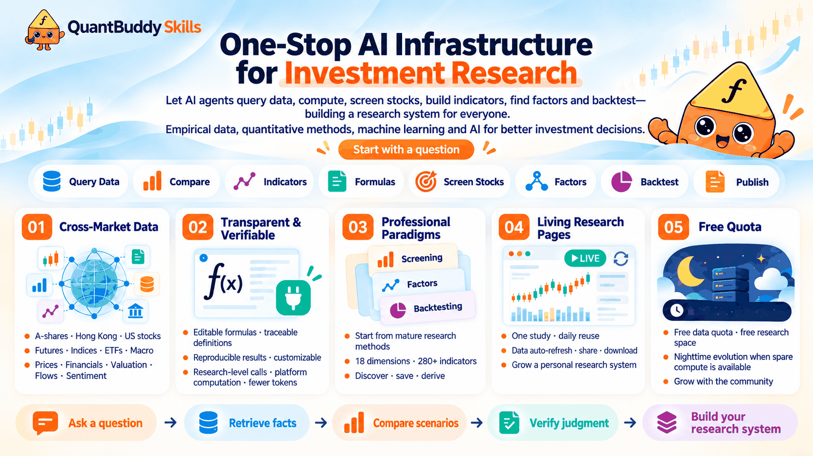
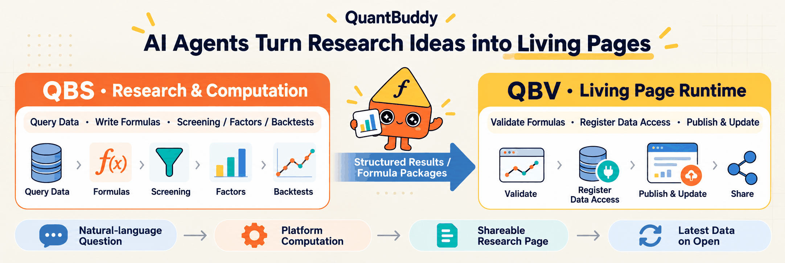
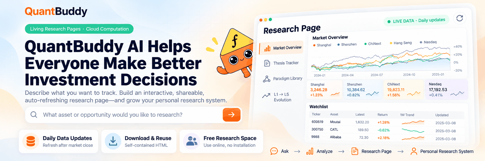
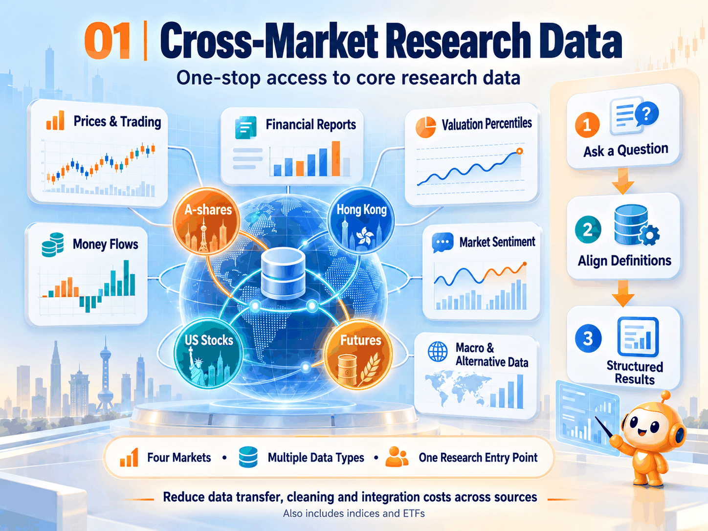
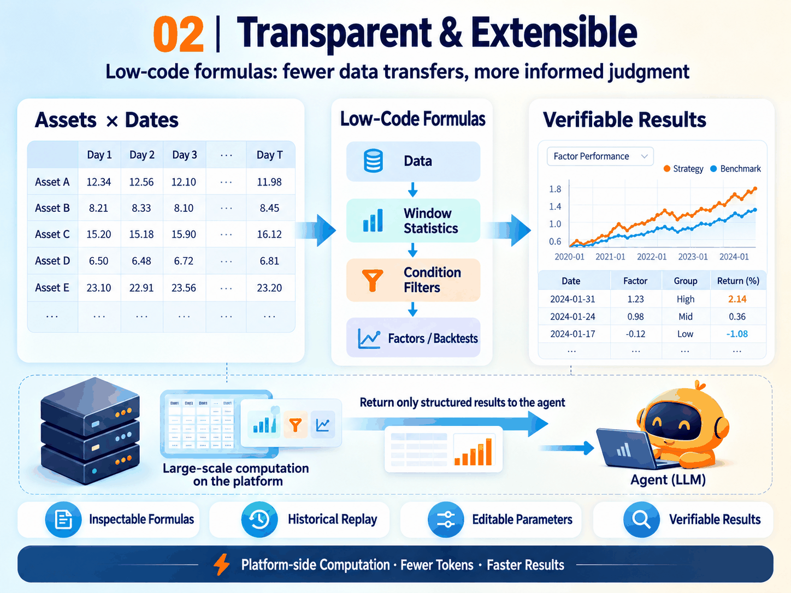
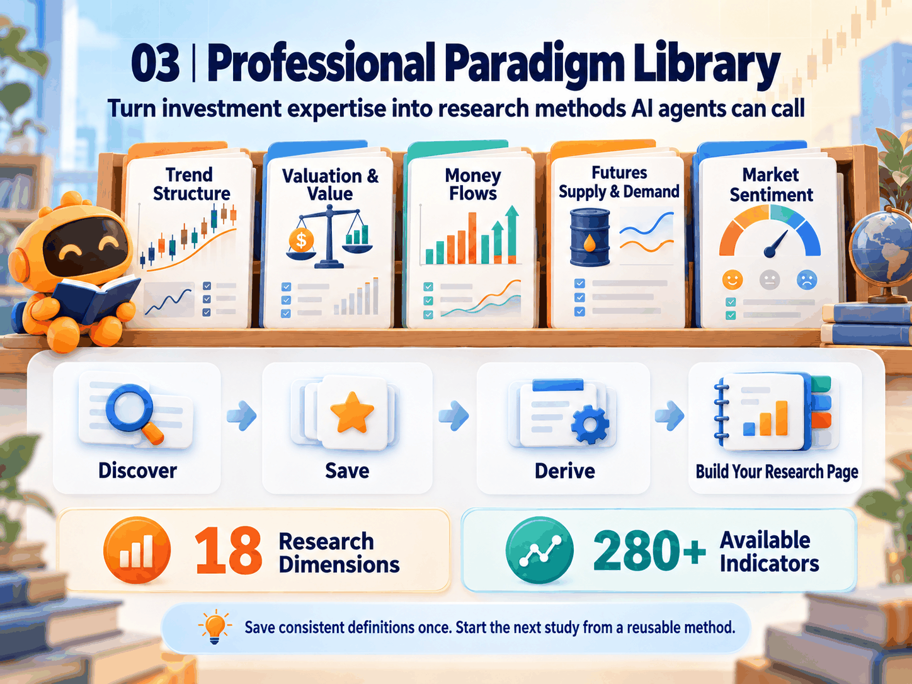
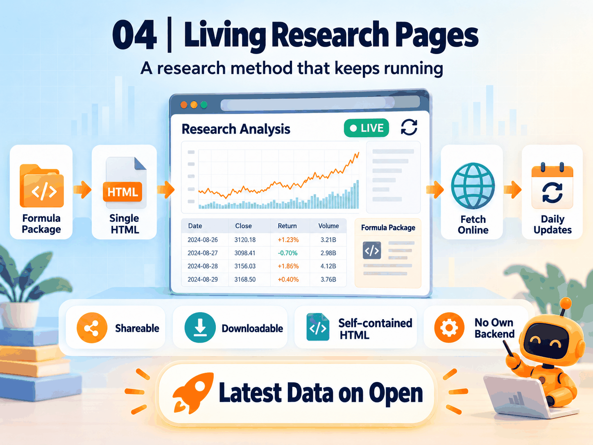
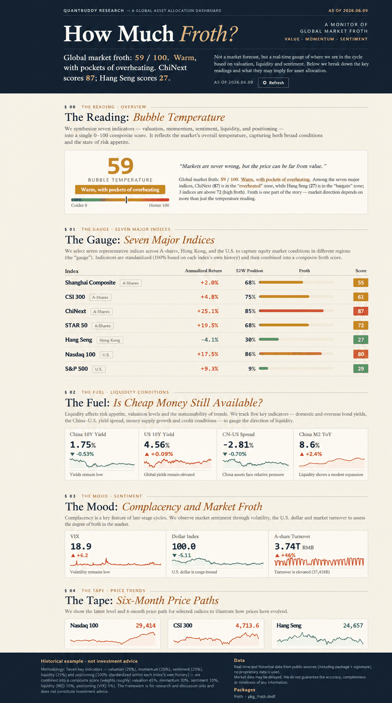
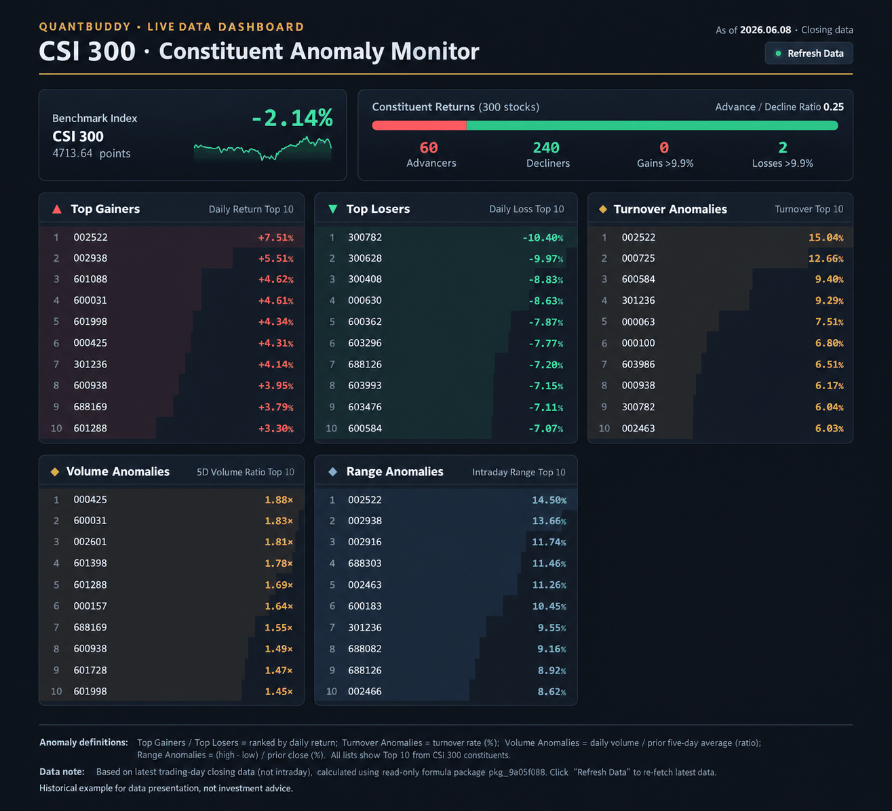

# quant-buddy-skills

<p align="center">
  <a href="https://www.quantbuddy.cn/videos/quantbuddy-research-demo.mp4">
    
  </a>
  <br/>
  <sub>Click the hero image to open the QuantBuddy research-page workflow demo.</sub>
</p>

<p align="center">
  <a href="README.md">中文</a> ·
  <a href="README.en.md">English</a> ·
  <a href="https://www.quantbuddy.cn">QuantBuddy</a> ·
  <a href="https://tcn8bvcbyokw.feishu.cn/wiki/E1zswck3oiiJjJkP07QcmSG3nle?from=from_copylink">Beginner Guide</a>
</p>

<p align="center">
  <a href="https://github.com/pseudo-longinus/quant-buddy-skills/stargazers"></a>
  <a href="https://github.com/pseudo-longinus/quant-buddy-skills/blob/main/LICENSE"></a>
  
  
</p>

## 🔥 Quick Install

If you use an AI agent such as Claude Code, Cursor, Codex, or OpenClaw, ask it to install:

> Install this skill for me:

```bash
npx skills add pseudo-longinus/quant-buddy-skills -g -a claude-code -s quant-buddy-skill -y
```

When `quant-buddy-skill` (QBS) is installed, companion-aware versions check QBV (`quant-buddy-view`) during the first `newSession` and install or update it when needed. QBS handles research intent, data queries, and computation; QBV turns verified results into shareable research pages. A QBV installation failure does not block QBS market-data, financial, formula, screening, or backtesting workflows.

To install QBV explicitly:

```bash
npx skills add pseudo-longinus/quant-buddy-skills -g -a claude-code -s quant-buddy-view -y
```

Replace `claude-code` with the agent id you use. Use `--all` only when you intentionally want every skill installed into every supported agent.

Not sure how to use agents or skills? Follow the [step-by-step beginner guide](https://tcn8bvcbyokw.feishu.cn/wiki/E1zswck3oiiJjJkP07QcmSG3nle?from=from_copylink).

---

> **QuantBuddy Skills is foundational quantitative-research infrastructure for AI agents.**
> Give the research idea to the agent; let the platform handle data, definitions, computation, and delivery.

It is more than a market-data chat skill or a raw-data API. It packages **data access, indicator definitions, formula computation, cross-sectional screening, factor research, backtesting, result verification, and research-page delivery** into callable agent capabilities.

Coverage includes A-shares, Hong Kong stocks, US stocks, indices, ETFs, domestic futures, macro strategy data, A-share options implied volatility, US options market data, LHB labels, and GICS classifications. Exact fields depend on the data contract returned by the service.

Traditional data APIs retrieve raw values. quant-buddy-skills lets an agent turn a natural-language research idea into **executable formulas, platform-side computation, structured evidence, and reusable tasks**.

Project site and demo: https://www.quantbuddy.cn

> This project is for financial data analysis, quantitative research, strategy validation, and educational use only. It is not investment advice, trading advice, a return guarantee, or an automated trading service.

## The Foundation: A Runnable Research Stack

QuantBuddy Skills separates research into four layers:

| Layer | What it provides | Why it matters |
|---|---|---|
| **Data** | Market, financial, valuation, money-flow, sentiment, futures supply/demand, macro, and alternative data | No need to rebuild data sources for every question |
| **Indicators** | 18 research dimensions, 280+ landed indicators, explicit windows, definitions, and scoring | The same concept can be compared and audited |
| **Computation** | Formulas, rolling windows, cross-sectional screens, factors, event studies, backtests, NAVs, and charts | Large matrices are computed on the platform; the agent receives evidence |
| **Delivery** | Formula packages, Data Grants, QBV pages, free hosting, and continuous updates | A validated research idea can be shared, reused, downloaded, and rerun |

The project organizes this foundation as an indicator system × a paradigm library: the indicator system defines how to calculate; the paradigm library defines how to apply validated research methods.

The stack provides transparent evidence, lower token usage, cross-market comparison, reusable formulas and pages, daily refreshes, and free evolution runs when spare compute is available.

## QBS + QBV: From A Question To A Living Research Page

QBS turns a natural-language research question into data queries, formulas, screens, or backtests. QBV publishes verified results as a page that can be reopened, shared, downloaded, and refreshed.

| Stage | Component | Result |
|---|---|---|
| Ask | `quant-buddy-skill` | Market data, financials, valuation, screens, factors, backtests, and charts |
| Build the method | QBS → QBV | Formula packages, data contracts, and reusable research structure |
| Publish and update | `quant-buddy-view` | A shareable `pages.quantbuddy.cn` page with the same data definition |

<p align="center">
  
  <br/>
  <sub>QBS computes and structures the research; QBV validates, publishes, and keeps the page running.</sub>
</p>

## Five Project Modules: From One Question To Continuous Research

This repository connects one entry point with five capability modules: start with a question, then move through data, computation, paradigms, research pages, and free evolution. Each diagram below is followed by the project capability it represents; all diagrams and screenshots in this English README use English-localized artwork while preserving the original figures and data examples.

### Starting Point | One Question To A Research Page

<p align="center">
  
  <br/>
  <sub>Start with a natural-language question and generate an interactive, shareable, continuously updated research page.</sub>
</p>

QBS interprets what you want to study and organizes the query, formula, screen, or backtest. QBV receives the verified structured result and turns it into a page that can be reopened and updated. The hero image above links to a full workflow demo, from the research question to the living page.

### 01 | Full Research-Data Coverage

<p align="center">
  
  <br/>
  <sub>Market, financial, valuation, money-flow, sentiment, futures supply/demand, macro, and alternative data enter one workflow.</sub>
</p>

QBS identifies the asset and market first, then follows the returned data contract for fields, dates, and coverage. Current scope includes A-shares, Hong Kong stocks, US stocks, indices, ETFs, domestic futures, macro strategy data, A-share option IV, US options, LHB labels, and GICS classifications; exact fields depend on the service response.

| Market / asset | Direct queries | Research actions | Boundary |
|---|---|---|---|
| A-share stocks and ETFs | Market, valuation, report-period financials, industries, money flow, LHB, sentiment | Formulas, cross-sectional screens, factors, backtests, industry aggregation, K-lines, minute tasks | Broadest field coverage |
| Hong Kong stocks | Market data, window returns, selected valuation / financial fields, southbound holdings | Materialized-indicator screens; formulas, comparisons, and pages for available fields | Do not apply A-share-only fields |
| US stocks and overseas ETFs | Market data, window returns, selected valuation / financial fields | Screens, formulas, comparisons, factors, and pages for available fields | Coverage depends on asset and API |
| Indices | A-share, sector/theme, and overseas index series | Benchmark comparison, return ranking, event studies, page charts | Minute coverage varies by market |
| Domestic futures | Main/continuous/nearby contracts, windows, spot, inventory, roll events | Futures screens, supply/demand research, continuous-contract comparison, selected minute tasks | No stock-style valuation or financials |
| Macro, options, and research datasets | Macro strategy data, A-share option IV, US options, GICS classifications | Macro context, volatility, classification aggregation, strategy research | Dataset-specific coverage |

`selectByComposition` supports `A股`, `港股`, `美股`, and `期货` through `universe.asset_scope` for current cross-sectional screens. Formula screening, factor ranking, and historical backtests follow each market's available fields. Report-period financial conditions can be aligned with price, moving-average, breakout, and turnover conditions. Snapshot and window queries process up to 1,000 assets per call; minute coverage follows the platform contract and returns an explicit notice when unavailable.

**Representative data experiment (QBS `fast_query`, run on 2026-10-06)**

One request queried close, return, turnover, and PE(TTM) for Kweichow Moutai in A-shares and Tencent in Hong Kong stocks. Each field keeps its own effective date:

| Asset | Close (date) | Return (date) | PE(TTM) (date) |
|---|---:|---:|---:|
| Kweichow Moutai (600519.SH) | 1,258.62 (2026-09-30) | 1.8647% (2026-09-30) | 19.3209 (2026-09-30) |
| Tencent (0700.HK) | 427.80 (2026-10-06) | 1.5670% (2026-10-06) | 16.2627 (2026-10-05) |

This is the useful behavior of the data layer: one cross-market request, units supplied by field metadata, and no false “single as-of date” when market data and valuation data refresh on different schedules.

### 02 | Transparent, Extensible Low-Code Computation

<p align="center">
  
  <br/>
  <sub>Compose data, window statistics, conditions, factors, and backtests with formulas; return structured, auditable results to the agent.</sub>
</p>

Low-code formulas preserve data dates, report periods, windows, and the calculation chain, with adjustable parameters, historical replay, and verifiable results. Large matrices stay on the platform side; the agent receives TopN lists, statistics, charts, or other structured evidence instead of raw tables.

**Representative computation experiment (QBS `runMultiFormulaBatchStream` + `readData`)**

Question: screen all A-shares for a 60-trading-day high, turnover above twice the past 20-day average, then rank by return. The platform executed seven formulas and the final read returned ten rows; the 2026-09-30 result included Shanshui Technology, Nanom Bio, Nearshore Protein, GuangKang Biotech, and Zhonghong Medical. `readData` reported `returned_rows=10`, `is_truncated=false`, and a cost of 2 RU.

The formulas state the research definition; the platform expands the asset matrix:

```text
60日高基准 = 昨天(最大("全市场每日最高价", 60))
放量突破Top10 = 取前("突破60日新高" * "成交额放量" * 涨跌幅("全市场每日收盘价"), 10, 返回数值)
```

```text
Natural-language condition → seven-formula chain → platform-side full-market computation → Top10 + returns → 2 RU read
```

### 03 | Professional Paradigm Library

<p align="center">
  
  <br/>
  <sub>Turn experienced investment methods into agent-callable paradigms that can be discovered, saved, derived, and reused.</sub>
</p>

The project separates “how to calculate” from “how to apply” by keeping an indicator system and a reusable paradigm library. It currently covers **18 research dimensions and 280+ landed indicators** (the local catalog records 327 candidates): trend structure, momentum and reversal, relative strength, volume and liquidity, money flow, pattern/volatility/risk, valuation, profitability, growth, cash-flow quality, financial safety, operating efficiency, financial distress, futures supply/demand, anomaly monitoring, LHB seats, market sentiment, and individual-stock sentiment.

These indicators support asset profiles, cross-market screens, factor portfolios, industry/theme aggregation, event studies, backtests, and research pages. Whether an indicator is materialized, for which market, and for which date is determined by `selection_ready`, `asset_scope`, `as_of`, and the actual service response.

**Representative paradigm-reuse experiment (online catalog + `selectByComposition`)**

The online catalog first finds two RSI-related candidates among 18 research dimensions. The selector then combines `A股_RSI强而不过热` as a score with `A股_短期高低点抬升` as a screen, and requires the RSI score to be positive. On the 2026-09-30 snapshot, the selector confirmed an A-share universe of 443 members and returned ten results; the leading names included 古越龙山, 泉阳泉, 复星医药, 华发股份, and 恒丰纸业. The reusable path is: discover an indicator → inspect its output type and snapshot date → put score/screen inputs in the correct slots → read a dated, explainable TopN result.

### 04 | Research Pages Keep Running

<p align="center">
  
  <br/>
  <sub>A page is more than a screenshot: bind a formula package, open it for current data, share it, or download a self-contained HTML file.</sub>
</p>

QBV has two distinct delivery paths: existing JPG, PNG, HTML, and PDF files can be published first as readable, shareable static pages in **free hosted research space**; a QBS result becomes continuously refreshable only after it is bound to a formula package or Data Grant. Dynamic pages can be downloaded as self-contained HTML, preserve an existing layout, add benchmark series, edit charts, reuse a page shell, and pass page-quality checks. Typical deliveries include asset profiles, valuation/financial pages, index anomalies, cross-asset comparisons, industry/theme opportunities, money-flow signals, fund/ETF/bond profiles, commodity reports, K-line pages, and strategy NAV dashboards.

**Two concrete delivery pages**

The two screenshots below show the formula-package page shape: the browser reads structured outputs with a public credential and renders the table/chart itself. They are not raw QBS tables, and the API key never enters the front end.

<p align="center">
  
  <br/>
  <sub><b>Global market temperature dashboard</b> · seven index returns, valuation-bubble temperature, commodities, and bonds.</sub>
</p>

<p align="center">
  
  <br/>
  <sub><b>CSI 300 constituent anomaly monitor</b> · return ranking, turnover/volume anomalies, and six-month price paths.</sub>
</p>

> The numbers are historical/example data for demonstrating delivery shape; they are not investment or trading advice.

### 05 | Start Free And Evolve

<p align="center">
  
  <br/>
  <sub>Free data quota, free research space, spare-compute queueing, and comparable new versions support iteration.</sub>
</p>

QBV can submit RSI, RSRS, screening logic, or backtests to an L1–L5 evolution path. Registration records the intent to evolve, not an immediately running job. Longer jobs run free at irregular intervals when spare compute is available, to add data, compare history, check definitions, or improve presentation. Jobs queue behind available resources; when a new version is ready, compare its changes and RU usage before adopting it.

**A reusable evolution request**

```text
Continue checking this RSI / RSRS page: add a longer history window and compare signal stability across L1–L3 versions. Queue it when spare compute is available, keep the original version, and report changes and RU usage when a candidate is ready.
```

“Submit” records the research objective; entering the execution queue still depends on spare capacity. Adopt a new page only after comparing its definitions, results, and resource usage with the original.

## Reusable Research Delivery Scenarios

The same data, indicator, and computation foundation can support different research products or embed into an existing site, course, desktop screen, or application:

| Scenario | Delivery | Example |
|---|---|---|
| Report reproduction / strategy testing | Replayable formula and backtest page | Recheck assumptions and keep signals/NAVs recalculating |
| Financial content / sector brief | Embeddable research page | Sector crowding, TopN definitions, and charts update with data |
| Desktop agent / finance screen | Condition-monitoring page | Show only meaningful changes, with evidence behind each signal |
| Website / mini-program / app | Custom method or screening page | Track valuation, quality, and trend candidates over time |
| Adviser / allocation workflow | Interactive client page | Connect horizon, risk, and liquidity preferences to updateable logic |
| Investment education | Experiment page | Adjust conditions, inspect formulas, and compare outcomes |

## Why Install It

- **Not just data lookup**: formulas, window statistics, condition filters, factor ranking, and backtesting.
- **Works across markets**: A-shares, Hong Kong stocks, US stocks, indices, ETFs, and domestic futures follow their own supported data contracts.
- **Reusable by design**: formulas explored today can be scheduled and rerun tomorrow.
- **QBS + QBV delivery**: install QBS, let it check QBV, then publish verified results to free hosting as shareable research pages.
- **Research can evolve**: RSI / RSRS, screening, and backtest pages can enter free spare-compute evolution.
- **Designed for agent workflows**: works with Claude Code, Cursor, Codex, GitHub Copilot, Windsurf, and similar environments.
- **Lower token cost**: large computation stays on the platform side; the agent receives structured evidence instead of raw matrices.

## What You Can Do In One Sentence

| What you tell the agent | What quant-buddy-skills does |
|---|---|
| “Check Kweichow Moutai's latest close, return, and turnover” | Queries market data and returns structured results |
| “Screen all A-shares for a volume-expanded 60-day breakout” | Runs full-market formulas, filters, and ranking on the platform side |
| “Rank Hong Kong stocks, US stocks, or futures by a materialized momentum or volatility indicator” | Uses the market-specific asset scope and returns names, scores, and data dates |
| “Backtest a low PE + high ROE portfolio and compare it with CSI 300” | Runs strategy backtesting, benchmark comparison, and NAV chart output |
| “Run this screen every day at 14:30” | Saves validated formulas as reusable tasks |
| “Publish this set of computed metrics as a data pack a web page can read directly” | Registers a formula package for API-key-free front-end queries |
| “Upload my CSV factor and rank it together with ROE” | Uploads custom factors and uses them in formulas, screening, and charts |

## Capability Matrix

| Capability | Coverage | Example prompt |
|---|---|---|
| Fast market data lookup | A-shares / HK stocks / US stocks / indices / recognized futures | “Check Kweichow Moutai's latest close, return, and turnover” |
| Valuation and financials | A-shares plus selected HK / US fields, subject to API results | “List CATL's latest ROE, net profit, and debt ratio” |
| Cross-market formulas | A-shares, HK stocks, US stocks, indices, ETFs, and domestic futures by field | “Calculate 20-day and 60-day returns in the selected market and rank momentum” |
| Multi-condition screening | Materialized indicators for A-shares / HK stocks / US stocks / futures, plus formula screening | “Screen the selected market for valuation, quality, momentum, or volatility conditions” |
| Factor analysis | 18 dimensions, materialized score/screen indicators, and uploaded CSV factors | “Build a composite factor from dividend yield, ROE, and momentum” |
| Strategy backtesting | A-share workflow is deepest; other markets depend on formulas and history | “Backtest a low PE + high ROE portfolio against CSI 300” |
| Minute data | A/US stocks, HK stocks, domestic futures, and domestic indices by coverage date | “Read the latest complete-day minute OHLCVA or a historical 1-minute CSV” |
| Asset profiles | Valuation, financials, money flow, volatility, macro win-rate context, and price dimensions | “Build a current profile for Tencent, Apple, or a gold future” |
| Industry, theme, and event research | Industry/theme constituents, return ranking, event windows, and scenarios | “Compare sector performance over the last 20 sessions” |
| Options and macro | A-share option IV, US options, macro strategy data, and GICS | “Organize options by expiry, strike, IV, or macro scenario” |
| Research pages and hosting | QBS results published by QBV to free hosting with sharing, download, and refresh | “Turn this research into a page I can reopen tomorrow” |

## Who Is This For

- **A-share, Hong Kong, US, and futures researchers** who want to validate screens, factors, event studies, backtests, or supply/demand ideas.
- **AI agent and coding-tool users** who want Claude Code, Cursor, Codex, or GitHub Copilot to complete research tasks directly.
- **Research automation developers** who want daily review, intraday screens, and strategy monitoring as repeatable jobs.
- **Financial data analysts and content creators** who want structured data, TopN lists, charts, and shareable pages from natural language.

## Who Is This Not For

- Users who need a fully custom low-level data pipeline.
- Users who need crypto data, stock-style futures valuation/financials, or a complete US fundamental database.
- Users expecting automated order execution, return guarantees, or personalized investment advice.

## Real Invocation Examples

The following examples are historical call records from 2026-05-18, so market values will change. The current reproducible experiments are placed under the five modules above; this section keeps the full parameter and reuse patterns.

### Example 1: Ask In Natural Language, Return Multiple Indicators

User prompt:

```text
Check Kweichow Moutai's latest close price, daily return, and turnover.
```

The agent generates and runs:

```text
贵州茅台收盘 = "全市场每日收盘价" * 取出(贵州茅台)
贵州茅台涨跌幅 = "全市场每日回报率" * 取出(贵州茅台)
贵州茅台成交额 = "全市场每日成交额" * 取出(贵州茅台)
```

Actual result:

| Date | Stock | Close | Daily Return | Turnover |
|---|---|---:|---:|---:|
| 2026-05-18 | Kweichow Moutai | 1323.69 | -0.70% | RMB 4.601B |

This is the shortest path: natural-language prompt -> formula generation -> platform-side data retrieval -> structured result.

### Example 2: Full-Market Formula Computation Without Sending Huge Tables To The LLM

User prompt:

```text
Screen all A-shares that break above their 60-day high today, with turnover greater than 2x the past 20-day average, then rank the top 10 by daily return.
```

The agent generates a formula chain:

```text
A股池 = 板块(万得全A) * 缺失填零("非ST股")
60日高基准 = 昨天(最大("全市场每日最高价", 60))
放量基准 = 昨天(平均("全市场每日成交额", 20))
突破60日新高 = ("全市场每日最高价" > "60日高基准") * "A股池"
成交额放量 = ("全市场每日成交额" > 2 * "放量基准") * "A股池"
排序值 = "突破60日新高" * "成交额放量" * 涨跌幅("全市场每日收盘价")
放量突破Top10 = 取前("排序值", 10, 返回数值)
```

Actual result:

| Rank | Stock | Ticker | Daily Return |
|---:|---|---|---:|
| 1 | 凡拓数创 | SZ301313 | 20.00% |
| 2 | 索辰科技 | SH688507 | 20.00% |
| 3 | 隆达股份 | SH688231 | 18.23% |
| 4 | 蓝思科技 | SZ300433 | 13.97% |
| 5 | 长盈通 | SH688143 | 13.21% |
| 6 | 广信材料 | SZ300537 | 13.12% |
| 7 | 卡倍亿 | SZ300863 | 12.70% |
| 8 | 佰奥智能 | SZ300836 | 11.79% |
| 9 | 线上线下 | SZ300959 | 11.68% |
| 10 | 中巨芯 | SH688549 | 10.48% |

The full-market raw matrix is not pushed into the LLM context. quant-buddy performs the computation, filtering, and ranking on the platform side, then returns only the Top 10 result. In the actual call, reading the final Top 10 detail returned only 10 rows, and the `readData` response showed `cost` = 2 RU.

### Example 3: Explore Once, Save The Formula, Reuse It Later

During exploration, the user can ask:

```text
Design a 14:30 intraday screening condition: break above the 60-day high, turnover above 2x the past 20-day average, and output the top 10 by return.
```

After validation, the formula can be saved as a reusable task:

```json
{
  "name": "volume_breakout_60d_intraday",
  "description": "14:30 intraday 60-day-high breakout with volume expansion",
  "params": {
    "formulas": [
      "A股池 = 板块(万得全A) * 缺失填零(\"非ST股\")",
      "60日高基准 = 昨天(最大(\"全市场每日最高价\", 60))",
      "放量基准 = 昨天(平均(\"全市场每日成交额\", 20))",
      "突破60日新高 = (\"全市场每日最高价\" > \"60日高基准\") * \"A股池\"",
      "成交额放量 = (\"全市场每日成交额\" > 2 * \"放量基准\") * \"A股池\"",
      "排序值 = \"突破60日新高\" * \"成交额放量\" * 涨跌幅(\"全市场每日收盘价\")",
      "放量突破Top10 = 取前(\"排序值\", 10, 返回数值)"
    ],
    "begin_date": 20260101,
    "include_description": true,
    "use_minute_data": true,
    "force_reusable_array": ["放量突破Top10"]
  }
}
```

After that, an agent or scheduler can run the same formula at 14:30 every day:

```bash
GZQ_PARAMS='<the params JSON above>' python scripts/call.py runMultiFormulaBatchStream
```

Then read the final result from the returned `data_id`:

```bash
GZQ_PARAMS='{"ids":["<data_id>"],"mode":"last_column_full"}' python scripts/call.py readData
```

This separates exploration from usage: explore and iterate with natural language first, then reuse stable formulas as production research tasks.

## Formula Packages: Publish a Validated Formula Set to the Outside

Example 3 fixes formulas into a task your own agent / scheduler reruns. **Formula packages** go one step further — register a validated set of formulas as a **long-lived data service** so your own web page, dashboard, or a third party can read the latest results repeatedly, **without an API Key**.

Register once (needs an API Key) and you get a pair of credentials, `package_id` + `signature`. After that, anywhere that can send an HTTP request can pull data **streamed over SSE** with those credentials. Whenever the underlying data updates, the server **recomputes automatically along the dependency graph**, so a query always returns the latest values — never stale data.

> How it differs from `runMultiFormulaBatchStream`: that runs on **your own account side** (the agent / scheduler executes and reads a `data_id`); a formula package instead **exposes the computed outputs read-only via a credential** — the query side needs no API Key and spends no quota of its own, and billing always lands on the **package owner**. The two execution pools and billing are independent.

**Use cases**

- **Build your own research daily report / dashboard**: register the metrics you review every day (screening lists, factor rankings, valuation percentiles, money flow, …) as one package, then `fetch` and render them from a single static HTML page. Open the page and you see today's latest data — **no backend, no manual recompute**.
- **Give a team / client a read-only data page**: hand out `package_id` + `signature`, not your API Key. They can only read the outputs you fixed — they can't change formulas or touch your account, and you can revoke any time.
- **Embed into an existing site / Notion / Feishu / a wall display**: anywhere `fetch` runs, you can pipe quant-buddy's computed results into your own page.
- **Third-party / lightweight integration**: hand a precomputed metric package to a partner for read-only access with zero config.

The two formula-package screenshots and their delivery explanation are under “04 | Research Pages Keep Running”; this section continues with registration, querying, and front-end integration code.

**Two-step usage**

```powershell
cd skills/quant-buddy-skill

# 1. Register (needs API Key): put formulas + reads in params.json; pass Chinese formulas with @file to avoid encoding truncation
python scripts/formula_package.py register @params.json

# 2. Query (no API Key): only package_id is needed; signature auto-fills from the locally saved credential
$env:FP_PARAMS='{"package_id":"pkg_xxx"}'
python scripts/formula_package.py query

# Manage: list / revoke / refresh (rotate signature)
python scripts/formula_package.py list    '{"page":1,"page_size":20}'
python scripts/formula_package.py revoke  '{"package_id":"pkg_xxx"}'
python scripts/formula_package.py refresh '{"package_id":"pkg_xxx","rotate_signature":true}'
```

Example `params.json` for registration (formula syntax is the same as `runMultiFormulaBatchStream`):

```json
{
  "formulas": [
    "排序值 = 涨跌幅(\"全市场每日收盘价\")",
    "放量突破Top10 = 取前(\"排序值\", 10, 返回数值)"
  ],
  "reads": [
    { "output": "放量突破Top10", "read_mode": "last_day_stats" }
  ],
  "ttl_days": 365
}
```

- Formulas not listed in `reads` are intermediate variables — computed but not exposed.
- Different outputs in the same package can use **different read modes**: `range_data` (full series over a date range) / `last_day_stats` (latest cross-section stats) / `last_valid_per_asset` (last valid value per asset).
- Up to 100 formulas and 20 exposed outputs per package; default validity 365 days.

**Query directly from a front end (no API Key)**

The query endpoint streams SSE. In the browser, read the stream with `fetch` (signature in the body, never the URL; do not use `EventSource`):

```js
const resp = await fetch('https://www.quantbuddy.cn/skill/queryFormulaPackage', {
  method: 'POST',
  headers: { 'Content-Type': 'application/json' },
  body: JSON.stringify({ package_id, signature }),
})
const reader = resp.body.getReader()
const decoder = new TextDecoder()
const outputs = {}
let buf = ''
for (;;) {
  const { value, done } = await reader.read()
  if (done) break
  buf += decoder.decode(value, { stream: true })
  const blocks = buf.split('\n\n'); buf = blocks.pop()
  for (const block of blocks) {
    const ev = (block.match(/event:\s*(.*)/) || [])[1]
    const dt = JSON.parse((block.match(/data:\s*([\s\S]*)/) || [])[1])
    if (ev === 'result') outputs[dt.output] = dt        // outputs["放量突破Top10"].data ...
    else if (ev === 'error') throw new Error(`${dt.code}: ${dt.message}`)
  }
}
```

> Register / list / revoke / refresh need an API Key and **must stay server-side**; only the query endpoint (`queryFormulaPackage`) is safe to expose to a browser. For full parameters, read-mode result structures, and error codes see `tools/formula_package.md`; end-to-end usage is in `recipes/formula-package.md`.

## Why Not Just Another Data API

Most data APIs solve one problem: getting raw data out. In real investment research, users usually need more than that:

- Can I quickly build a custom full-market indicator?
- Can I validate a stock-screening idea without writing data cleaning and backtesting code?
- Can the formula I explored today be reused tomorrow at 14:30 with intraday data?
- Can I avoid pushing huge tables into the LLM context and return only computed results?

The core idea behind quant-buddy-skills is simple: the agent understands the goal and organizes the task, while quant-buddy handles data access, formula computation, financial SOPs, and result delivery.

## Core Advantages

### 1. Formula Engine: From Data Lookup To Indicator Computation

quant-buddy-skills supports formulas that combine market data, valuation data, financial data, window statistics, masks, and ranking logic. Users are not just querying basic fields. They are asking the agent to generate executable full-market formulas.

### 2. Separate Exploration From Reuse

Investment research is not a one-off chat. An idea usually has two stages:

| Stage | User Goal | What quant-buddy-skills Provides |
|---|---|---|
| Exploration | Try ideas, adjust conditions, inspect results | Agent-generated formulas, platform-side computation and backtesting |
| Usage | Reuse a validated formula every day | Stable formula tasks that can be called by agents or schedulers |

### 3. RU-Based Usage And Better Token Efficiency

The common “data + LLM” pattern often pushes large raw tables into the model context and asks the model to process them. That consumes many tokens, slows down responses, and increases context noise.

quant-buddy-skills uses “platform-side computation + result return”: large datasets do not enter the LLM context, formula computation happens on the platform side, and the agent receives structured results, stock lists, statistics, or charts.

### 4. Built-In Financial SOPs

Quantitative research is not only arithmetic. It also requires careful handling of trading calendars, adjusted prices, rolling windows, ranking, benchmarks, event dates, net value curves, and chart output. quant-buddy-skills packages common financial SOPs into agent-callable capabilities.

### 5. Better Infrastructure For Financial Agents

The common pattern is:

```text
Data + LLM
```

quant-buddy-skills uses:

```text
Data + Computation + LLM
```

The difference is that computation is not improvised inside the LLM context with ad hoc code. It is provided as stable platform capability.

## Comparison

| Dimension | News / Research-Report Finance Skill | Quant Framework Documentation Skill | Data API | quant-buddy-skills |
|---|---|---|---|---|
| Core value | Interpret news, generate views | Help agents find docs and write code | Pull raw data | Run research computation on the platform side |
| Cross-market cross-sectional screening | Weak | Requires custom code | Requires data stitching | Materialized indicators support A-shares / HK / US stocks / futures |
| Factors / backtesting | Usually external | Helps write frameworks | User implements it | Built-in workflows |
| Token usage | Medium | Medium / high | High when raw data enters context | Low, returns only results |
| Best users | Content, reports, event tracking | Quant developers | Data engineering, custom pipelines | Quant researchers, research automation, agent users |
| Best scenario | “What does this news affect?” | “How do I call the QMT API?” | “I need raw data” | “Cross-market screening / factors / backtesting / charts / research pages” |

## Installation

### npx Recommended

New users should install the skill only into the AI agent they actually use. Avoid using `--all` by default: it installs all skills into all supported agents and may create multiple directories or symlinks on the machine.

| Agent you use | Recommended command |
|---|---|
| Claude Code | `npx skills add pseudo-longinus/quant-buddy-skills -g -a claude-code -s quant-buddy-skill -y` |
| Cursor | `npx skills add pseudo-longinus/quant-buddy-skills -g -a cursor -s quant-buddy-skill -y` |
| OpenClaw | `npx skills add pseudo-longinus/quant-buddy-skills -g -a openclaw -s quant-buddy-skill -y` |

If you use another supported agent, replace the value after `-a` with that agent id. Do not omit `-a`, otherwise the CLI may auto-install into multiple agents.

If you use multiple agents, repeat `-a`:

```bash
npx skills add pseudo-longinus/quant-buddy-skills -g -s quant-buddy-skill -a claude-code -a cursor -y
```

List the skills in this repository without installing anything:

```bash
npx skills add pseudo-longinus/quant-buddy-skills --list
```

Update an existing installation:

```bash
npx skills update quant-buddy-skill -g -y
```

If Windows users encounter symlink or permission errors, add `--copy` to the command for the target agent, for example:

```bash
npx skills add pseudo-longinus/quant-buddy-skills -g -a claude-code -s quant-buddy-skill -y --copy
```

Use this only when you explicitly want to install into every supported agent:

```bash
npx skills add pseudo-longinus/quant-buddy-skills -g --all
```

Check the current install location:

```bash
npx skills list -g --json
```

## Configure API Key

Before first use, configure your quant-buddy API key:

1. Go to https://www.quantbuddy.cn to register and get an API key.
2. Edit `config.json` under the skill directory and fill in the `api_key` field.
3. Or send this to an agent environment that can write local files:

```text
Help me configure APIkey: sk-xxxxxxxx
```

## Runtime Requirements

- Python 3.8+, Python 3.11 recommended.
- Core market data, financial data, screening, and backtesting features only depend on the Python standard library.
- Optional dependencies:
  - `python-dateutil`: used by event-study helpers.
  - `Pillow`: used for chart image conversion.
  - `requests`: used by optional event-news search helpers.
- Optional environment variable: `BOCHA_API_KEY`, only used by event-news search helpers.

## Security, Privacy, And Disclaimer

- The quant-buddy API key is only used to request quant-buddy platform APIs.
- The API key is only sent as an HTTP `Authorization` header to declared quant-buddy domains. It is not written to logs and is not forwarded to third-party hosts.
- Optional `BOCHA_API_KEY` is only used when event-news search is enabled.
- This project is for financial data analysis, quantitative research, strategy validation, and educational use only. It is not investment advice, trading advice, a return guarantee, or an automated trading service.
- Backtest results do not represent future returns. Users should verify data definitions, transaction costs, slippage, risk exposure, and compliance requirements independently.

## Troubleshooting

- Environment dependencies: `references/environment.md`
- Troubleshooting: `references/troubleshooting.md`
- RU billing: `references/ru-billing.md`

## Contact

For more strategy examples, integration questions, roadmap updates, and real research workflows, scan the QR codes below to connect or join the community.

<p align="center">
  <table>
    <tr>
      <td align="center">
        
        <br/>
        <sub>Personal WeChat</sub>
      </td>
      <td align="center">
        
        <br/>
        <sub>QuantBuddy Research Discussion Group</sub>
      </td>
    </tr>
  </table>
  <br/>
  <sub>Scan to connect and discuss quantitative research, AI agent workflows, and strategy validation cases.</sub>
</p>

## Star History

<a href="https://www.star-history.com/?repos=pseudo-longinus%2Fquant-buddy-skills&type=date&legend=top-left">
 <picture>
   <source media="(prefers-color-scheme: dark)" srcset="https://api.star-history.com/chart?repos=pseudo-longinus/quant-buddy-skills&type=date&theme=dark&legend=top-left" />
   <source media="(prefers-color-scheme: light)" srcset="https://api.star-history.com/chart?repos=pseudo-longinus/quant-buddy-skills&type=date&legend=top-left" />
   
 </picture>
</a>

## License

MIT
