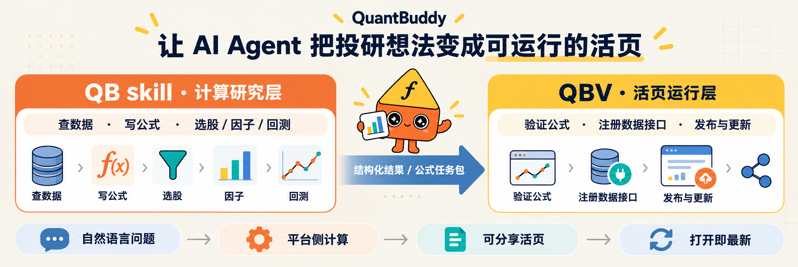
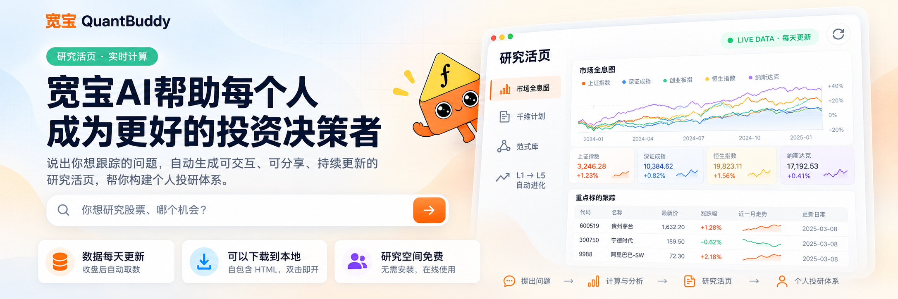
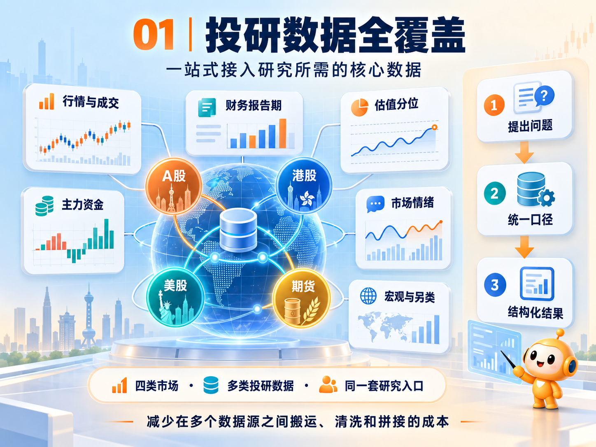
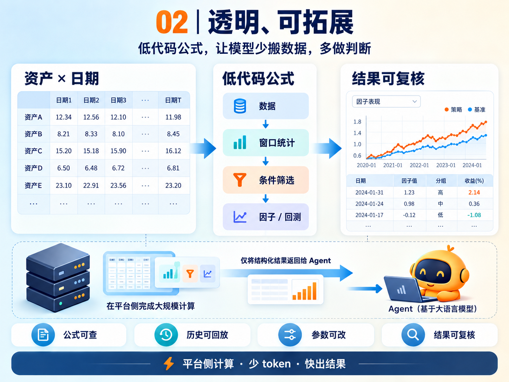
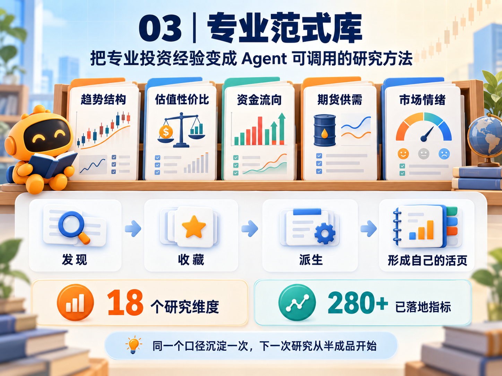
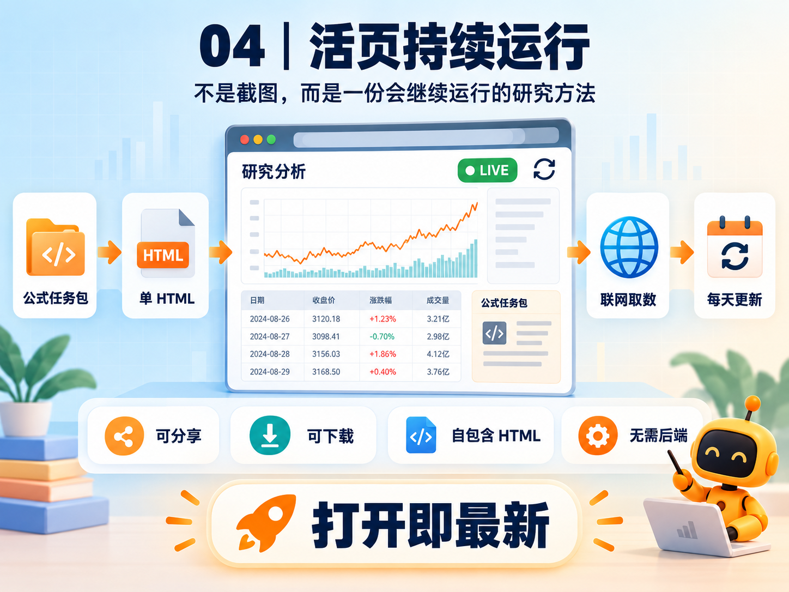

# quant-buddy-skills

<p align="center">
  <a href="https://www.quantbuddy.cn/videos/quantbuddy-research-demo.mp4">
    
  </a>
  <br/>
  <sub>点击首图打开 QuantBuddy 研究活页演示视频：从一句研究问题，到可交互、可分享、持续更新的研究活页。</sub>
</p>

<p align="center">
  <a href="README.md">中文</a> ·
  <a href="README.en.md">English</a> ·
  <a href="https://www.quantbuddy.cn">QuantBuddy</a> ·
  <a href="https://tcn8bvcbyokw.feishu.cn/wiki/E1zswck3oiiJjJkP07QcmSG3nle?from=from_copylink">新手教程</a>
</p>

<p align="center">
  <a href="https://github.com/pseudo-longinus/quant-buddy-skills/stargazers"></a>
  <a href="https://github.com/pseudo-longinus/quant-buddy-skills/blob/main/LICENSE"></a>
  
  
</p>

> **QuantBuddy 把量化和实证分析变成每个人都能使用的投研基础设施。**
>
> - **可以直接做：** 查数据、做比较、算指标、构造公式、选股、找因子、回测、发布活页
> - **覆盖主要市场：** A 股、港股、美股、期货、指数、ETF、宏观数据
> - **研究结果可持续使用：** 公式可改、口径可查、结果可复核，研究可以沉淀为个人投研系统

## 🔥 3 秒快速安装

如果你熟悉 Agent 工具（Claude Code、Cursor、OpenClaw 等），可以直接对 AI Agent 说：

> 帮我安装这个 skill：

```bash
npx skills add pseudo-longinus/quant-buddy-skills -g -a claude-code -s quant-buddy-skill -y
```

安装 `quant-buddy-skill`（QBS）时，支持 companion 的版本会在首次 `newSession` 调用 QBV（`quant-buddy-view`）检查，并按需自动安装或更新它。QBS 负责理解问题、查数和计算，QBV 负责把结果发布成可分享的研究活页；QBV 安装失败不会影响 QBS 的行情、财务、公式、筛选和回测。

如果希望立即启用活页发布能力，也可以显式安装 QBV：

```bash
npx skills add pseudo-longinus/quant-buddy-skills -g -a claude-code -s quant-buddy-view -y
```

把命令中的 `claude-code` 换成你正在使用的 Agent ID 即可。只有在明确希望把仓库内全部 skill 安装到全部 Agent 时，才使用 `--all`。

如果你不懂如何使用 Agent 和 skill，可以按照[小白图文教程](https://tcn8bvcbyokw.feishu.cn/wiki/E1zswck3oiiJjJkP07QcmSG3nle?from=from_copylink)一步步展开。

---

> **QuantBuddy Skills 是一套给 AI Agent 使用的底层量化研究基础设施。**
> 把投研想法交给 Agent，把数据、计算、口径和交付交给一套可以持续运行的研究底座。

它不是只回答行情的聊天 Skill，也不是把原始表格丢给模型的数据接口。它把**数据接入、指标口径、公式计算、横截面筛选、因子研究、策略回测、结果验证和研究活页交付**沉淀成 AI Agent（智能代理）可直接调用的底层能力。

覆盖 A 股、港股、美股、指数、ETF、境内期货，以及宏观策略、A 股期权隐含波动率、美国期权行情、龙虎榜标签和 GICS 行业等数据；不同市场的字段以实际接口返回为准。

传统数据 API 只负责"把数据拉出来"；quant-buddy-skills 负责让 AI Agent 把自然语言投研想法转成**可执行公式、平台侧计算、结构化结果和可复用任务**。

项目主页与演示：https://www.quantbuddy.cn

> 本项目用于金融数据分析、量化研究、策略验证和教育用途，不构成投资建议、交易建议、收益承诺或自动交易服务。

## 先理解它是什么：一套可运行的研究底层

QuantBuddy Skills 把一次投研拆成四层。每层都能被 Agent 调用，也能把结果交给下一层继续使用：

| 底层 | 提供什么 | 解决什么问题 |
|---|---|---|
| **数据层** | 四类市场行情、财务、估值、资金、情绪、期货供需、宏观和另类数据 | 不再为每个问题临时拼数据源和字段 |
| **指标层** | 18 个研究维度、280+ 已落地指标、明确窗口、口径和打分方式 | 同一个概念有统一定义，结果可以追溯和比较 |
| **计算层** | 公式、窗口、横截面筛选、因子、事件研究、回测、净值和图表 | 把“大表搬运”变成平台侧计算，只返回判断所需结果 |
| **交付层** | 公式任务包、Data Grant、QBV 研究活页、免费托管和持续更新 | 一次研究可以分享、复用、下载和继续运行 |

项目把这两部分组织为 **“指标体系 × 研究范式”**：指标体系回答“怎么算”，把维度拆成有口径的指标；研究范式回答“怎么用”，把验证过的流程固定成可复用活页。底层框架因此同时保留计算细节和研究方法，而不是只输出一张静态图片。

这套底层框架带来几个直接好处：

- **透明可核验**：保留数据日期、报告期、指标口径、公式链和结果证据，方便复盘与审计。
- **把算力留给判断**：大规模矩阵在平台侧计算，Agent 只接收 TopN、统计量、图表或结构化证据，降低上下文和传输成本。
- **跨市场可比较**：A 股、港股、美股、期货在各自市场内按同一研究维度计算和排序，避免把不同市场字段强行混用。
- **一次研究，多次复用**：公式、指标和页面结构可以沉淀为任务包、范式或活页，下一次从已有方法继续。
- **结果会继续更新**：活页按交易日刷新；RSI、RSRS、选股和回测研究还可以在富余算力时申请免费自动进化。
- **端侧足够轻**：数据和计算在云端，页面可以分享、下载为自包含 HTML，并嵌入网站、课程、桌面屏幕或自己的应用。

## QBS + QBV：从问题到持续更新的研究活页

QBS 和 QBV 是一条完整链路：QBS 把自然语言投研问题转成数据查询、公式、筛选或回测；QBV 把经过验证的结果发布成可以反复打开、分享和更新的研究活页。

能力边界和调用顺序以仓库内的 [QBS SKILL.md](skills/quant-buddy-skill/SKILL.md) 与 [QBV SKILL.md](skills/quant-buddy-view/SKILL.md) 为准；README 只提炼当前版本已经验证过的公开能力。

| 阶段 | 负责组件 | 你得到的结果 |
|---|---|---|
| 提出问题 | `quant-buddy-skill` | 行情、财务、估值、全市场筛选、因子、回测和图表结果 |
| 沉淀方法 | QBS → QBV | 公式任务包、数据合同和可复用的研究结构 |
| 发布与更新 | `quant-buddy-view` | `pages.quantbuddy.cn` 上的可分享活页，按同一口径持续取数和更新 |

<p align="center">
  
  <br/>
  <sub>QBS 负责查数据、写公式、选股 / 因子 / 回测；QBV 负责验证、注册数据接口、发布与更新活页。</sub>
</p>

## 五个能力模块：从问题到持续运行

这个仓库把一次投研拆成一个入口和五个相互衔接的能力模块：先提出问题，再依次经过数据、计算、范式、活页、免费与进化。下面每张图对应一段可以由 AI Agent 调用的能力，说明紧跟在图下方；图中的产品界面文字保留原始版本，便于对照实际使用。

### 起点｜一问生成研究活页

<p align="center">
  
  <br/>
  <sub>从自然语言问题开始，生成可交互、可分享、持续更新的研究活页。</sub>
</p>

QBS 先理解“想研究什么”，再组织查询、公式、筛选或回测；QBV 接收经过验证的结构化结果，生成可以反复打开的研究活页。顶部首图链接到一段完整演示视频，展示的也是这条从问题到页面的链路。

### 01｜跨市场投研数据

<p align="center">
  
  <br/>
  <sub>把行情、财务、估值、资金、情绪、期货供需、宏观和另类数据接入同一套研究入口。</sub>
</p>

QBS 会先识别资产和市场，再按实际数据合同返回字段、日期和覆盖状态。当前能力覆盖 A 股、港股、美股、指数、ETF、境内期货，以及宏观策略、A 股期权隐含波动率、美国期权、龙虎榜标签和 GICS 行业等专项数据；字段以接口实际返回为准。

| 资产 / 市场 | 可直接查询的内容 | 可做的研究动作 | 边界 |
|---|---|---|---|
| A 股股票、ETF | 行情、估值、报告期财务、行业、资金流、龙虎榜、市场/个股情绪 | 公式计算、横截面筛选、因子、回测、行业聚合、K 线和分钟任务 | 字段最丰富；ETF 也在资产库中 |
| 港股 | 行情、窗口收益、部分估值和报告期财务、南向持仓字段 | 已物化指标筛选；对可用字段做公式、比较和页面 | 不把 A 股专属字段强套到港股 |
| 美股、境外 ETF | 行情、窗口收益、部分估值和报告期财务 | 已物化指标筛选；公式、比较、因子和页面 | 覆盖随资产和接口返回变化 |
| 指数 | A 股、行业/主题及海外指数行情和窗口序列 | 基准对比、收益比较、行业排名、事件研究、活页图表 | 不同市场的分钟覆盖不同 |
| 境内期货 | 主力/连续/次主力行情、窗口、现货、库存和换月事件 | 期货筛选、供需研究、连续合约比较、部分分钟任务 | 不承诺股票式估值、财务或 K 线 |
| 宏观、期权及研究数据 | 宏观/策略数据、A 股期权隐含波动率、美国期权行情、GICS 分类等 | 宏观背景、波动率、分类聚合、策略研究 | 按数据集提供专项能力 |

`selectByComposition` 的 `universe.asset_scope` 支持 `A股`、`港股`、`美股`、`期货` 四类当前横截面筛选；公式筛选、因子排序和历史回测则按各市场可用字段执行。日频财务条件会按报告期/发布日期对齐，再叠加价格、均线、突破和成交量条件。快照、窗口和报告期查询单次最多处理 1000 个资产；分钟能力以平台合同和覆盖日期为准，覆盖不足时会明确返回提示。

**代表性查数实验（QBS `fast_query`，2026-10-06 执行）**

一次请求同时查询 A 股贵州茅台和港股腾讯控股的收盘价、涨跌幅、成交额与 PE(TTM)，结果按字段自己的日期返回：

| 资产 | 收盘价（日期） | 涨跌幅（日期） | PE(TTM)（日期） |
|---|---:|---:|---:|
| 贵州茅台（600519.SH） | 1,258.62（2026-09-30） | 1.8647%（2026-09-30） | 19.3209（2026-09-30） |
| 腾讯控股（0700.HK） | 427.80（2026-10-06） | 1.5670%（2026-10-06） | 16.2627（2026-10-05） |

这个结果体现了数据层的关键行为：跨市场一次查数、单位由字段元数据给出，行情与估值日期不同也不会被错误合并成同一个“截至日”。

### 02｜透明、可验证的低代码计算

<p align="center">
  
  <br/>
  <sub>用公式串起数据、窗口统计、条件筛选、因子和回测；平台侧计算后只返回结构化结果。</sub>
</p>

低代码公式保留数据日期、报告期、窗口和计算链，支持参数调整、历史回放和结果复核。大规模矩阵在平台侧完成，Agent 接收 TopN、统计量、图表或其他结构化证据，减少上下文和传输成本，也避免临时手写数据清洗、字段 join 和回测代码。

**代表性计算实验（QBS `runMultiFormulaBatchStream` + `readData`）**

问题：筛选全 A 股中近 60 个交易日创新高、成交额高于过去 20 日均值 2 倍，并按涨幅取前 10。平台侧执行 7 条公式，最终读取只返回 10 行；2026-09-30 的结果包括善水科技、南模生物、近岸蛋白、广康生化、中红医疗等，`readData` 显示 `returned_rows=10`、`is_truncated=false`、本次读取消耗 2 RU。完整公式仍放在后面的“真实调用示例”，这里先看清输入、平台计算和结构化输出的关系。

核心公式只需表达研究口径，平台负责展开资产矩阵：

```text
60日高基准 = 昨天(最大("全市场每日最高价", 60))
放量突破Top10 = 取前("突破60日新高" * "成交额放量" * 涨跌幅("全市场每日收盘价"), 10, 返回数值)
```

```text
自然语言条件 → 7 条公式链 → 平台侧全市场计算 → Top10 名单与涨幅 → 2 RU 读取
```

### 03｜专业投研范式

<p align="center">
  
  <br/>
  <sub>把专业投资经验沉淀为 Agent 可调用的方法：发现、收藏、派生，再形成自己的研究活页。</sub>
</p>

项目把“怎么算”和“怎么用”分别沉淀为指标体系与研究范式。目前覆盖 **18 个研究维度、280+ 个已落地指标**（本地目录记录 327 个指标候选），包括趋势结构、动量与反转、相对强度、量能与流动性、资金流向、形态/波动/风控、估值性价比、盈利能力、盈利成长、现金流质量、财务安全、运营效率、财务爆雷风险、期货供需、异动监控、龙虎榜资金席位、市场情绪和个股情绪。

这些指标可用于单资产画像、跨市场筛选、因子组合、行业/主题聚合、事件研究、回测和研究活页。是否已物化、支持哪个市场和哪个日期，以服务端的 `selection_ready`、`asset_scope`、`as_of` 和实际返回为准。

**代表性范式复用实验（在线目录 + `selectByComposition`）**

先用在线目录按“RSI”发现 18 个研究维度中的两个候选指标，再把 `A股_RSI强而不过热`（score）与 `A股_短期高低点抬升`（screen）组合，并设置 RSI 分数大于 0。2026-09-30 快照下，选择器确认全 A 股宇宙 443 个成员，返回 10 个结果；排名前列包括古越龙山、泉阳泉、复星医药、华发股份和恒丰纸业。这个过程对应范式库的实际使用路径：发现指标 → 查看输出类型与快照日期 → 按 score/screen 放入正确位置 → 读取带口径和日期的 TopN，而不是把指标名称当成一段无法复核的描述。

### 04｜活页持续运行

<p align="center">
  
  <br/>
  <sub>活页不是截图：绑定公式任务包后，打开即可联网取最新值，也可以分享或下载自包含 HTML。</sub>
</p>

QBV 有两条清晰的交付路径：已有 JPG、PNG、HTML、PDF 先原样发布到**免费托管空间**，得到可阅读、可分享的静态页；QBS 验证结果再绑定公式任务包或 Data Grant，才会在联网打开时继续取最新数据。动态活页可以下载为自包含 HTML，也可以保留已有页面结构、追加基准序列、编辑图表、复用页面壳并做版本验收。常见交付包括个股画像、估值/财务页、指数异动、跨资产比较、行业/主题机会、资金流信号、基金/ETF/债券画像、商品日报、K 线和策略净值看板。

**两个实际交付页面**

下面两张图对应公式任务包的真实静态页面形态：浏览器用公开凭证取结构化结果，页面自己渲染表格和图表；它们不是 QBS 原始数据表，也不会把 API Key 放进前端。

<p align="center">
  
  <br/>
  <sub><b>全球市场温度看板</b>　·　七大股指涨跌、估值泡沫温度、商品与债券走势。</sub>
</p>

<p align="center">
  
  <br/>
  <sub><b>沪深300 个股异动监控</b>　·　涨跌幅榜、换手 / 量能异动和半年价格轨迹。</sub>
</p>

> 以上数字为历史 / 示例数据，用于说明页面交付形态，不构成投资或交易建议。

### 05｜免费额度与社区共成长

<p align="center">
  
  <br/>
  <sub>免费数据额度、免费研究空间、富余算力排队运行和可对比的新版本，让研究可以持续迭代。</sub>
</p>

QBV 支持把 RSI、RSRS、选股逻辑或回测研究提交到 L1–L5 自动进化路径。登记的是进化意愿，不是立即创建任务；平台会在有富余算力时不定期免费运行较长任务，用于补充数据、做历史比较、检查口径或改进页面呈现。任务按后台资源排队，不承诺立即完成；生成后可比较版本变化和 RU 变化，再决定是否采用。

**一个可复用的进化请求**

```text
继续检查这张 RSI / RSRS 活页：补充更长历史窗口，比较 L1–L3 版本的信号稳定性；有富余算力时排队运行，完成后保留原版本并给出新旧版本与 RU 变化。
```

这里的“提交”只登记研究目标；是否进入运行队列取决于后台富余算力。新版本生成后再比较口径、结果和资源用量，决定是否替换原活页。

## 可复用的研究交付场景

同一套数据、指标和计算底座可以承载不同的研究产品，也可以嵌入已有网站、课程、桌面屏幕或应用：

| 场景 | 交付形态 | 典型结果 |
|---|---|---|
| 研报复现 / 策略测试 | 可回放的公式和回测活页 | 用历史数据复核假设，持续重算信号和净值 |
| 财经内容 / 行业周报 | 可嵌入的研究活页 | 行业拥挤度、TopN 口径和图表随数据更新 |
| 桌面机器人 / 金融屏幕 | 条件变化监控页 | 只呈现值得关注的变化，每条信号可回到证据 |
| 网站 / 小程序 / App | 自己的方法页或选股页 | 组合低估值、盈利质量、趋势观察，持续跟踪候选变化 |
| 金融顾问 / 资产配置 | 面向客户的交互式方案页 | 把期限、风险和流动性偏好接进可更新的配置逻辑 |
| 投资教育 | 可实验的课程活页 | 学生调整条件、查看公式、比较有效与失效情景 |

## 为什么值得安装

- **不是只查数据**：支持公式、窗口统计、条件筛选、因子排序和策略回测。
- **适合跨市场横截面计算**：A 股、港股、美股、期货都可以进入已物化指标的选择器；平台侧完成大规模计算，只把结果返回给 AI Agent（智能代理）。
- **能沉淀为可复用任务**：今天探索出的公式，明天可以固定时间重复运行。
- **从计算到交付一条链路**：安装 QBS 时会检查并调用 QBV；QBV 提供免费托管空间，把验证后的结果变成可分享活页。
- **研究可以继续进化**：RSI / RSRS、选股和回测活页可提交后台自动进化；富余算力可用时不定期免费运行。
- **面向 AI Agent（智能代理）工作流设计**：适配 Claude Code（编程智能代理）、Cursor（智能编辑器）、Codex（编程智能代理）、GitHub Copilot（编程助手）、Windsurf（智能编辑器）等环境。
- **四类市场各有研究路径**：A 股覆盖最完整；港股、美股支持行情、窗口、部分估值/财务和横截面选择；境内期货支持行情、现货、库存、连续合约和部分供需研究；具体字段以接口返回为准。
- **覆盖更多投研数据**：支持 A 股财务、港美股财务、龙虎榜标签、GICS 行业等常用投研数据。

## 一句话能做什么

| 你对 AI Agent（智能代理）说 | quant-buddy-skills 做什么 |
|---|---|
| “查贵州茅台最新收盘价、涨跌幅、成交额” | 调用行情数据，返回结构化结果 |
| “筛全 A 股放量突破 60 日新高的前 10 只” | 平台侧执行全市场公式、筛选、排序，只返回 Top10（前十名） |
| “在港股 / 美股 / 期货里按已上线动量或波动指标取 TopN” | 按 `asset_scope` 调用横截面选择器，返回名单、分项分数和数据日期 |
| “回测低 PE（市盈率）+ 高 ROE（净资产收益率）组合，相对沪深 300 画净值” | 执行策略回测、基准对比、输出净值曲线 |
| “把这个选股条件每天 14:30 跑一遍” | 将验证过的公式沉淀为可复用任务 |
| “把这组算好的指标发布成一个网页能直接读的数据包” | 注册成公式任务包，返回凭证，前端/第三方免 API Key 流式取最新值 |
| “上传我的 CSV（逗号分隔值文件）因子，和 ROE（净资产收益率）一起做排序” | 上传自有因子并参与公式计算、选股和图表输出 |

## Skill Matrix（能力矩阵）

| 能力 | 支持范围 | 典型提示词 |
|---|---|---|
| 快速行情查询 | A 股 / 港股 / 美股 / 指数 / 可识别期货（行情以工具返回为准） | “查一下贵州茅台最新收盘价、涨跌幅和成交额” |
| 估值与财务 | A 股 / 港股 / 美股部分字段（以接口返回为准） | “列出宁德时代最近报告期 ROE、净利润和资产负债率” |
| 常用投研数据 | A 股财务、港美股财务、龙虎榜标签、GICS 行业等 | “查一下归母净利润、EBITDA、龙虎榜净买额、GICS 行业” |
| 全市场公式计算 | A 股、港股、美股、指数、ETF、境内期货按字段支持 | “计算指定市场 20 日收益和 60 日收益，并按动量排序” |
| 多条件选股 | `selectByComposition` 支持 A 股 / 港股 / 美股 / 期货的已物化指标；公式筛选按数据字段执行 | “筛选指定市场的低估值、高质量、动量或波动条件” |
| 因子分析 | 18 个研究维度、已物化 score/screen 指标、自有 CSV 因子；A 股目录最完整 | “用股息率、ROE、动量做复合因子排序” |
| 策略回测 | A 股工作流最完整；其他市场按公式和历史数据支持情况执行 | “回测低 PE + 高 ROE 组合，相对沪深 300 画净值” |
| 盘中与历史分钟 | A/美股股票、港股、境内期货、境内指数按覆盖日期提供分钟能力 | “查询某资产最近完整交易日分钟 OHLCVA，或读取历史 1 分钟 CSV” |
| 个股 / 资产画像 | 单资产开放式画像，估值、财务、资金、波动、宏观胜率和走势维度按市场返回 | “生成腾讯控股 / 苹果 / 黄金期货的最新画像” |
| 行业、主题与事件 | 行业/主题精确成分、收益排名、事件研究和情景窗口 | “比较申万行业近 20 日表现并做事件前后收益” |
| 期权与宏观研究 | A 股期权 IV、美国期权行情、宏观策略数据和 GICS 分类 | “按到期日、执行价、IV 或宏观情景整理研究数据” |
| 图表渲染 | K 线、净值、基准对比 | “把策略净值和沪深 300 画成图” |
| 公式任务包 | 把公式组注册成长期包，对外免 API Key（接口密钥）SSE 取数 | “把这组选股公式发布成一个数据页，前端直接取最新结果” |
| 研究活页与托管 | QBS 结果交给 QBV 发布到免费研究空间，支持分享、下载和持续更新 | “把这次研究做成一个能反复打开的活页” |
| 自动进化 | QBV 在富余算力可用时不定期免费运行 RSI / RSRS、选股或回测研究的进化任务 | “继续检查这张活页并自动进化” |
| 自有数据 | CSV（逗号分隔值文件）因子上传 | “上传我的因子 CSV，和 ROE 一起排序” |

## 最近的能力进展

- **当前版本**：仓库远端当前记录为 QBS `4.25.49`、QBV `0.6.87`；安装 QBS 时，支持 companion 的版本会在首次 `newSession` 检查并按需安装/更新 QBV。
- **大结果读取更可控**：QBS 现在按场景区分 `signature`、`last_column_full`、`last_day_stats`、`range_data`、`per_asset_sample` 等读取模式；QBV 公式包会检查 `is_truncated`，不把摘要结果当完整名单。
- **K 线已走实时运行时**：普通 K 线活页使用同一份 OHLCV Data Grant 绘制蜡烛、成交量和均线；只有明确要求图片时才走 PNG 渲染路径。
- **QBS → QBV 交接更完整**：验证过的计算结果、数据范围和页面意图可以一起交给 QBV，减少重复查数和手工拼页面。
- **已有文件可以先活页化**：JPG、PNG、HTML、PDF 等已有材料可以先原样托管为可阅读页面，再继续做数据增强或研究改造。
- **分钟数据覆盖更清晰**：历史分钟区间查询会区分完整覆盖、部分覆盖和越界情况，并返回覆盖提示，不把空结果误当成有效数据。
- **资产与专项数据继续扩展**：资产目录包含约 5316 个 A 股、2858 个港股、1069 个美股/境外 ETF、513 个指数和 239 个期货条目；同时补充美股期权、A 股期权 IV、宏观策略和 GICS 分类目录，实际可用字段仍以服务端返回为准。
- **公式任务更适合长期复用**：公式包支持指定日期或偏移读取，适合把探索过的指标接到看板、网页和调度任务中。
- **页面交付有验收边界**：QBV 会在页面发布和可访问性确认后再交付最终活页链接，避免把草稿或未验证页面当成成品。

## 适合谁

- **A 股、港股、美股和期货研究员**：想快速验证选股、因子、事件研究、回测或供需想法。
- **AI Agent（智能代理）和 AI 编程工具用户**：想让 Claude Code（编程智能代理）、Cursor（智能编辑器）、Codex（编程智能代理）、GitHub Copilot（编程助手）直接完成投研任务。
- **投研自动化开发者**：想把每日复盘、盘中筛选、策略监控固化为可重复运行的任务。
- **金融数据分析师 / 内容创作者**：想从自然语言直接得到结构化数据、TopN（前 N 名）名单和图表。

## 不适合谁

- 只需要完全自定义底层数据管道的人。
- 需要加密货币数据，或要求期货估值/财务、美股完整基本面数据库的人；当前版本提供的是按专项数据集和接口字段返回的研究能力。
- 期待自动交易下单、收益承诺或个性化投资建议的人。

## 真实调用示例

以下示例是仓库保留的历史调用记录，生成于 2026-05-18；行情会随市场刷新变化。当前可复现实验已放在上面的五个模块下，下面的完整示例用于补充参数和复用方式。

### 示例 1：自然语言查数，一次返回多个指标

用户可以直接问：

```text
查一下贵州茅台最新收盘价、涨跌幅和成交额。
```

AI Agent（智能代理）会生成并执行公式：

```text
贵州茅台收盘 = "全市场每日收盘价" * 取出(贵州茅台)
贵州茅台涨跌幅 = "全市场每日回报率" * 取出(贵州茅台)
贵州茅台成交额 = "全市场每日成交额" * 取出(贵州茅台)
```

实际返回结果：

| 日期 | 股票 | 收盘价 | 涨跌幅 | 成交额 |
|---|---|---:|---:|---:|
| 2026-05-18 | 贵州茅台 | 1323.69 | -0.70% | 46.01 亿元 |

这个例子展示的是“自然语言提问 -> 公式生成 -> 平台侧取数 -> 结构化结果返回”的最短路径。

### 示例 2：全市场公式计算，不把大表塞进上下文

用户可以问：

```text
筛选全 A 股中，今天突破 60 日新高、成交额高于过去 20 日均值 2 倍，并按当日涨跌幅排序的前 10 名。
```

AI Agent（智能代理）会生成公式链：

```text
A股池 = 板块(万得全A) * 缺失填零("非ST股")
60日高基准 = 昨天(最大("全市场每日最高价", 60))
放量基准 = 昨天(平均("全市场每日成交额", 20))
突破60日新高 = ("全市场每日最高价" > "60日高基准") * "A股池"
成交额放量 = ("全市场每日成交额" > 2 * "放量基准") * "A股池"
排序值 = "突破60日新高" * "成交额放量" * 涨跌幅("全市场每日收盘价")
放量突破Top10 = 取前("排序值", 10, 返回数值)
```

实际返回结果：

| 排名 | 股票 | 代码 | 当日涨跌幅 |
|---:|---|---|---:|
| 1 | 凡拓数创 | SZ301313 | 20.00% |
| 2 | 索辰科技 | SH688507 | 20.00% |
| 3 | 隆达股份 | SH688231 | 18.23% |
| 4 | 蓝思科技 | SZ300433 | 13.97% |
| 5 | 长盈通 | SH688143 | 13.21% |
| 6 | 广信材料 | SZ300537 | 13.12% |
| 7 | 卡倍亿 | SZ300863 | 12.70% |
| 8 | 佰奥智能 | SZ300836 | 11.79% |
| 9 | 线上线下 | SZ300959 | 11.68% |
| 10 | 中巨芯 | SH688549 | 10.48% |

这里没有把全市场几千只股票的原始矩阵塞进 LLM（大语言模型）上下文。平台侧先完成全市场计算、筛选和排序，最终只返回 Top10（前十名）结果。实际调用中，读取最终 Top10（前十名）明细只返回 10 行，`readData`（读取数据）响应显示 `cost`（消耗字段）=2 RU（资源用量单位）。

### 示例 3：探索后把公式固化，后续直接调用

第一次使用时，用户可以自然语言探索：

```text
帮我设计一个 14:30 盘中选股条件：突破 60 日新高，同时成交额超过过去 20 日均值 2 倍，输出涨幅前 10。
```

当这个条件被验证后，可以把公式保存为固定任务：

```json
{
  "name": "volume_breakout_60d_intraday",
  "description": "14:30 盘中放量突破 60 日新高选股",
  "params": {
    "formulas": [
      "A股池 = 板块(万得全A) * 缺失填零(\"非ST股\")",
      "60日高基准 = 昨天(最大(\"全市场每日最高价\", 60))",
      "放量基准 = 昨天(平均(\"全市场每日成交额\", 20))",
      "突破60日新高 = (\"全市场每日最高价\" > \"60日高基准\") * \"A股池\"",
      "成交额放量 = (\"全市场每日成交额\" > 2 * \"放量基准\") * \"A股池\"",
      "排序值 = \"突破60日新高\" * \"成交额放量\" * 涨跌幅(\"全市场每日收盘价\")",
      "放量突破Top10 = 取前(\"排序值\", 10, 返回数值)"
    ],
    "begin_date": 20260101,
    "include_description": true,
    "use_minute_data": true,
    "force_reusable_array": ["放量突破Top10"]
  }
}
```

之后可以跳过反复解释需求，直接由 AI Agent（智能代理）或调度系统在每天 14:30 调用同一套公式：

```bash
GZQ_PARAMS='<上面的 params JSON（数据交换格式）>' python scripts/call.py runMultiFormulaBatchStream
```

执行后，从返回的 `data_id`（数据标识）读取最终结果：

```bash
GZQ_PARAMS='{"ids":["<data_id>"],"mode":"last_column_full"}' python scripts/call.py readData
```

这就是“探索阶段”和“使用阶段”的区别：探索阶段用自然语言快速改想法，使用阶段直接复用公式和接口，把投研流程固化为可重复执行的生产任务。

## 公式任务包（Formula Package）：把验证过的公式组对外发布

示例 3 把公式固化成「Agent / 调度自己重复跑」的任务；**公式任务包**再往前一步——把一组验证过的公式**注册成一个长期数据服务**，让你自己的网页、看板或第三方**无需 API Key（接口密钥）**就能反复取到最新结果。

注册一次（需 API Key），拿到一对凭证 `package_id` + `signature`；之后任何能发 HTTP（超文本传输协议）请求的地方，凭这对凭证就能以 **SSE（服务器推送事件）流式**取数。底层数据一更新，服务端**自动按依赖关系重算**，取数永远拿最新值、绝不返回过期数据。

> 与 `runMultiFormulaBatchStream`（全市场公式批算）的区别：后者是 Agent / 调度在**你自己的账号侧**执行、读 `data_id`（数据标识）；公式任务包是把算好的产出**以凭证形式对外只读开放**，取数方无需 API Key、也不消耗其配额，费用始终计入**包所有者**。两者执行池与计费相互独立。

**典型场景**

- **自建投研日报 / 数据看板**：把每天复盘要看的指标（选股名单、因子排序、估值分位、资金流向……）注册成一个包，用一个静态 HTML（网页）页面 `fetch`（浏览器取数）渲染。打开页面即当日最新，**无需后端、无需每天手动重跑公式**。
- **给团队 / 客户一个只读数据页**：发出去的是 `package_id` + `signature`，不是 API Key；对方只能读你固定的产出，改不了公式、拿不到账号权限，可随时撤销。
- **嵌进已有网站 / Notion / 飞书 / 大屏**：任何能跑 `fetch` 的地方都能把 quant-buddy（量化投研平台）的计算结果接进你自己的页面。
- **第三方 / 轻量集成**：把一个算好的指标包交给合作方只读对接，零配置接入。

两个公式任务包页面的截图和交付解释已放在“04｜活页持续运行”下；本节继续给出注册、查询和前端接入代码。

**两段式用法**

```powershell
cd skills/quant-buddy-skill

# 1. 注册（需 API Key）：params.json 写 formulas + reads，中文公式用 @file 传避免编码截断
python scripts/formula_package.py register @params.json

# 2. 取数（无需 API Key）：只需 package_id，signature 可由本地落盘凭证自动补全
$env:FP_PARAMS='{"package_id":"pkg_xxx"}'
python scripts/formula_package.py query

# 管理：列表 / 撤销 / 刷新（轮换签名）
python scripts/formula_package.py list    '{"page":1,"page_size":20}'
python scripts/formula_package.py revoke  '{"package_id":"pkg_xxx"}'
python scripts/formula_package.py refresh '{"package_id":"pkg_xxx","rotate_signature":true}'
```

注册用的 `params.json` 示例（公式语法与 `runMultiFormulaBatchStream` 同款）：

```json
{
  "formulas": [
    "排序值 = 涨跌幅(\"全市场每日收盘价\")",
    "放量突破Top10 = 取前(\"排序值\", 10, 返回数值)"
  ],
  "reads": [
    { "output": "放量突破Top10", "read_mode": "last_day_stats" }
  ],
  "ttl_days": 365
}
```

- 未列入 `reads` 的公式只作中间变量参与计算、不对外返回。
- 同一个包里不同产出可用**不同读取模式**：`range_data`（区间完整序列）/ `last_day_stats`（最新截面统计）/ `last_valid_per_asset`（每个资产最后一个有效值）。
- 单包最多 100 条公式、20 个对外产出，默认有效期 365 天。

**前端直接取数（无需 API Key）**

取数接口走 SSE，浏览器用 `fetch` 读流（签名放 body、不进 URL，不要用 `EventSource`）：

```js
const resp = await fetch('https://www.quantbuddy.cn/skill/queryFormulaPackage', {
  method: 'POST',
  headers: { 'Content-Type': 'application/json' },
  body: JSON.stringify({ package_id, signature }),
})
const reader = resp.body.getReader()
const decoder = new TextDecoder()
const outputs = {}
let buf = ''
for (;;) {
  const { value, done } = await reader.read()
  if (done) break
  buf += decoder.decode(value, { stream: true })
  const blocks = buf.split('\n\n'); buf = blocks.pop()
  for (const block of blocks) {
    const ev = (block.match(/event:\s*(.*)/) || [])[1]
    const dt = JSON.parse((block.match(/data:\s*([\s\S]*)/) || [])[1])
    if (ev === 'result') outputs[dt.output] = dt        // outputs["放量突破Top10"].data ...
    else if (ev === 'error') throw new Error(`${dt.code}: ${dt.message}`)
  }
}
```

> 注册 / 列表 / 撤销 / 刷新需 API Key，**必须放在服务端**；只有取数接口（`queryFormulaPackage`）可暴露给浏览器。完整参数、读取模式结构与错误码见 `tools/formula_package.md`，端到端用法见 `recipes/formula-package.md`。

## 为什么不是普通数据 API

普通数据 API（应用程序接口）主要解决“把数据拉出来”。但在真实投研里，用户更常遇到的问题是：

- 我想临时构造一个全市场指标，能不能直接算？
- 我想验证一个选股想法，能不能不用手写数据清洗和回测代码？
- 我今天探索出的公式，明天能不能在 14:30 用日内数据再跑一遍？
- 我不想把大表塞进模型上下文，能不能只把计算结果返回给 LLM（大语言模型）？

quant-buddy-skills 的核心思路是：让 AI Agent（智能代理）负责理解目标和组织任务，让 quant-buddy（量化投研平台）负责数据调用、公式计算、金融 SOP（标准作业流程）和结果输出。

## 核心优势

### 1. 公式引擎：从查数据到算指标

quant-buddy-skills 支持通过公式语言组合行情、估值、财务、窗口统计、掩码条件和排序逻辑。用户不只是在查基础数据，而是在让 AI Agent（智能代理）生成可执行的全市场计算公式。

### 2. 探索阶段与使用阶段分离

投研不是一次性问答。一个想法通常要经历两个阶段：

| 阶段 | 用户目标 | quant-buddy-skills 的作用 |
|---|---|---|
| 探索阶段 | 用自然语言试想法、改条件、看结果 | AI Agent（智能代理）生成公式，平台侧执行计算和回测 |
| 使用阶段 | 固定公式，每天重复运行 | 将公式沉淀为可复用任务，可接入 AI Agent（智能代理）或外部调度 |

### 3. RU（资源用量单位）计费，提升 token efficiency（文本用量效率）

传统“数据 + LLM（大语言模型）”模式通常会把大量原始数据塞进上下文，让模型自己处理。这样 token（模型文本计量单位）消耗高、速度慢，也更容易出现上下文污染。

quant-buddy-skills 采用“平台侧计算 + 结果返回”的方式：大规模数据不进入 LLM（大语言模型）上下文，公式计算在平台侧完成，返回的是结构化结果、名单、统计值或图表。

### 4. 内置金融 SOP（标准作业流程）

量化投研不只是算数，还需要处理交易日、复权、窗口、排序、基准、事件日期、净值曲线和图表输出等细节。quant-buddy-skills 将常见金融 SOP（标准作业流程）封装成 AI Agent（智能代理）可调用能力，降低用户自己写流程时的错误率。

### 5. 更适合作为 AI Agent（智能代理）基础设施

一般模式是：

```text
数据 + LLM（大语言模型）
```

quant-buddy-skills 的模式是：

```text
数据 + 计算 + LLM（大语言模型）
```

区别在于：计算层不再临时交给 LLM（大语言模型）用上下文和代码拼出来，而是由平台提供稳定的结构化能力。

## 对比

| 维度 | 新闻 / 研报型金融 Skill（技能） | 量化框架文档 Skill（技能） | 数据 API（应用程序接口） | quant-buddy-skills |
|---|---|---|---|---|
| 核心价值 | 解读新闻、生成观点 | 帮 AI Agent（智能代理）查文档、写代码 | 拉取数据 | 平台侧执行投研计算 |
| 跨市场横截面筛选 | 弱 | 需要自行写代码 | 需要自行拼数据 | 已物化指标支持 A 股 / 港股 / 美股 / 期货 |
| 因子 / 回测 | 通常需要外部实现 | 帮写框架 | 需要用户实现 | 内置工作流 |
| token（模型文本计量单位）消耗 | 中 | 中 / 高 | 高，常塞数据 | 低，只返回结果 |
| 适合用户 | 内容 / 研报 / 事件跟踪 | 量化开发者 | 数据工程 / 自定义管道 | 量化研究员、投研自动化、AI Agent（智能代理）用户 |
| 最佳场景 | “这条新闻影响什么” | “QMT 接口怎么写” | “我要原始数据” | “跨市场筛选 / 因子 / 回测 / 图表 / 活页” |

## 安装

### npx（Node.js 包执行工具，推荐）

建议新用户**只安装到自己正在使用的 AI Agent（智能代理）**，不要默认使用 `--all`。`--all` 等价于安装全部 skill 到全部支持的 agent，可能在本机创建多处目录或符号链接。

| 你使用的 Agent | 推荐命令 |
|---|---|
| Claude Code | `npx skills add pseudo-longinus/quant-buddy-skills -g -a claude-code -s quant-buddy-skill -y` |
| Cursor | `npx skills add pseudo-longinus/quant-buddy-skills -g -a cursor -s quant-buddy-skill -y` |
| OpenClaw | `npx skills add pseudo-longinus/quant-buddy-skills -g -a openclaw -s quant-buddy-skill -y` |

如果你使用其他支持的 Agent，把 `-a` 后面的值替换为对应 agent id；不要省略 `-a`，避免 CLI 自动安装到多个 Agent。

如果你同时使用多个 Agent，可以重复指定 `-a`：

```bash
npx skills add pseudo-longinus/quant-buddy-skills -g -s quant-buddy-skill -a claude-code -a cursor -y
```

先查看仓库里有哪些 skill（只列出，不安装）：

```bash
npx skills add pseudo-longinus/quant-buddy-skills --list
```

已安装用户更新：

```bash
npx skills update quant-buddy-skill -g -y
```

Windows（微软桌面操作系统）用户如果遇到 symlink（符号链接）或权限错误，可以在对应 Agent 命令后追加 `--copy`，例如：

```bash
npx skills add pseudo-longinus/quant-buddy-skills -g -a claude-code -s quant-buddy-skill -y --copy
```

只有在你明确希望安装到所有支持的 Agent 时，才使用：

```bash
npx skills add pseudo-longinus/quant-buddy-skills -g --all
```

查看当前安装位置：

```bash
npx skills list -g --json
```

## 配置 API Key（接口密钥）

首次使用前需要配置 quant-buddy API Key（接口密钥）：

1. 前往 https://www.quantbuddy.cn 注册并获取 API Key（接口密钥）。
2. 编辑 skill（技能包）目录下的 `config.json`，将 `api_key` 字段填入你的 Key（密钥）。
3. 或在支持写入本地文件的 AI Agent（智能代理）对话中发送：

```text
帮我配置 APIkey：sk-xxxxxxxx
```

## 运行环境

- Python（编程语言）3.8+，推荐 Python（编程语言）3.11。
- 核心行情、财务、选股和回测能力仅依赖 Python（编程语言）标准库。
- 可选依赖：
  - `python-dateutil`：事件研究辅助功能使用。
  - `Pillow`：图表图片格式转换时使用。
  - `requests`：事件新闻搜索辅助功能使用。
- 可选环境变量：`BOCHA_API_KEY`，仅事件新闻搜索辅助功能使用。

## 安全、隐私与免责声明

- quant-buddy API Key（接口密钥）仅用于请求 quant-buddy（量化投研平台）接口。
- API Key（接口密钥）只作为 HTTP（超文本传输协议）`Authorization` 头发送到 quant-buddy（量化投研平台）声明域名，不写入日志，不转发给第三方主机。
- 可选 `BOCHA_API_KEY` 仅在事件新闻搜索功能启用时使用。
- 本项目用于金融数据分析、量化研究、策略验证和教育用途，不构成投资建议、交易建议、收益承诺或自动交易服务。
- 回测结果不代表未来收益。用户应自行核验数据口径、交易成本、滑点、风险暴露和合规要求。

## 故障排查

- 环境依赖说明：`references/environment.md`
- 故障排查：`references/troubleshooting.md`
- RU（资源用量单位）计费说明：`references/ru-billing.md`

## 联系作者

想看更多策略案例、接入问题、更新路线和真实投研工作流，欢迎添加微信或加入交流群。

<p align="center">
  <table>
    <tr>
      <td align="center">
        
        <br/>
        <sub>个人微信</sub>
      </td>
      <td align="center">
        
        <br/>
        <sub>QuantBuddy 投研科学讨论群</sub>
      </td>
    </tr>
  </table>
  <br/>
  <sub>扫码添加微信或加入交流群，欢迎交流量化投研、AI Agent（智能代理）工作流和策略验证案例。</sub>
</p>

## Star History

<a href="https://www.star-history.com/?repos=pseudo-longinus%2Fquant-buddy-skills&type=date&legend=top-left">
 <picture>
   <source media="(prefers-color-scheme: dark)" srcset="https://api.star-history.com/chart?repos=pseudo-longinus/quant-buddy-skills&type=date&theme=dark&legend=top-left" />
   <source media="(prefers-color-scheme: light)" srcset="https://api.star-history.com/chart?repos=pseudo-longinus/quant-buddy-skills&type=date&legend=top-left" />
   
 </picture>
</a>

## License（开源许可证）

MIT（麻省理工开源许可证）
